<p align="center">
  <h1 align="center">🌊 Crescent City Intelligence Platform</h1>
  <p align="center">
    <strong>Scrape · Verify · Export · View · Chat · Stream · Monitor · Alert · Analyze · Query</strong><br/>
    The most comprehensive local intelligence platform for the
    <a href="https://crescentcity.org">City of Crescent City, CA</a> —
    powered by <a href="https://ecode360.com/CR4919">ecode360.com/CR4919</a>
  </p>
  <p align="center">
    <a href="https://github.com/docxology/crescent-city-intel"></a>
    <a href="#-quick-start"></a>
    <a href="docs/modules/llm.md"></a>
    <a href="LICENSE"></a>
    <a href="#-test-suite"></a>
    <a href="#-commands-reference"></a>
  </p>
</p>

---

## 📋 Table of Contents

- [🏙️ About Crescent City, CA](#-about-crescent-city-ca)
- [✨ What This Does](#-what-this-does)
- [🏗️ Architecture](#-architecture)
- [🚀 Quick Start](#-quick-start)
- [🖥️ Web Viewer Features](#-web-viewer-features)
- [💬 LLM / RAG Chat](#-llm--rag-chat)
- [📡 Real-Time Monitoring & Alerts](#-real-time-monitoring--alerts)
- [📊 Analytics & Readability](#-analytics--readability)
- [🧭 Intelligence Domains](#-intelligence-domains)
- [📦 Export Formats](#-export-formats)
- [🔒 Integrity Guarantees](#-integrity-guarantees)
- [📂 Project Structure](#-project-structure)
- [📚 Municipal Code Structure](#-municipal-code-structure)
- [🧪 Test Suite](#-test-suite)
- [⚡ Commands Reference](#-commands-reference)
- [⚙️ Configuration](#-configuration)
- [📖 Documentation](#-documentation)
- [⚠️ Known Limitations](#-known-limitations)

---

## 🏙️ About Crescent City, CA

**Crescent City** is the county seat of **Del Norte County**, California — a coastal city of ~6,000 residents at **41.76°N, 124.20°W**, nestled between the Pacific Ocean and ancient redwood forests near the Oregon border.

### Quick Facts

| Fact | Detail |
| :--- | :--- |
| 🗺️ Location | Northernmost California coast, Del Norte County, 2 sq mi incorporated area |
| 👥 Population | ~6,046 (2024 est.) — includes ~3,000 inmates at Pelican Bay State Prison |
| 💰 Economy | Commercial crab fishing · harbor commerce · timber (historical) · tourism |
| 🌲 Natural Setting | [Redwood National & State Parks](https://www.nps.gov/redw/) · [Jedediah Smith Redwoods SP](https://www.parks.ca.gov/?page_id=413) · Smith River |
| 🏛️ Government | Mayor + City Council · Planning Commission · Harbor Commission |
| 🔐 Major employer | [Pelican Bay State Prison](https://www.cdcr.ca.gov/facility-locator/pbsp/) — maximum security, ~1,000 staff |
| 💧 Water | Precipitation ~70 in/yr · Smith River (last undammed major California river) |
| 🌊 Tsunami risk | **CRITICAL** — 1964 Good Friday Earthquake: 21 ft waves, 11 deaths, $17M damage |
| 🌍 Seismic risk | **HIGH** — Cascadia Subduction Zone can produce M9+ megathrust events |
| 🏠 Housing | 17% poverty rate · median income $35,540 · active homelessness response |

### 🌊 Tsunami Capital of California

Crescent City has experienced more significant tsunami impacts than any other US West Coast city. The **1964 Alaska Good Friday Earthquake (M9.2)** sent 21-foot waves through the harbor and downtown, killing 11 and destroying 289 city blocks. The city's unique harbor geometry — a natural funnel — amplifies distant Pacific tsunamis. The **Battery Point Lighthouse** (1856), located on a tidal island accessible only at low tide, survived; it now serves as a museum and tsunami education center.

Today, Crescent City operates a comprehensive tsunami preparedness program:
- Vertical evacuation structure: **Howland Hill Road** refuge
- **Del Norte Office of Emergency Services** coordinates with [CalOES](https://www.caloes.ca.gov/hazard-mitigation/tsunami/)
- **NOAA Pacific Tsunami Warning Center** (Palmer, AK) provides automated alerts
- Regular community drills and updated evacuation route signage

### 🔗 Key Civic & Government Resources

| Resource | URL | Notes |
| :--- | :--- | :--- |
| City of Crescent City | [crescentcity.org](https://crescentcity.org) | City Council agendas · permits · public notices |
| Municipal Code (live) | [ecode360.com/CR4919](https://ecode360.com/CR4919) | Official ordinance database |
| Del Norte County | [co.del-norte.ca.us](https://www.co.del-norte.ca.us/) | County Board of Supervisors · Clerk |
| Crescent City Harbor | [crescentcityharbor.com](https://crescentcityharbor.com) | Harbor Commission · fishing permits |
| Redwood National & State Parks | [nps.gov/redw](https://www.nps.gov/redw/) | Adjacent to city; major tourism driver |
| Battery Point Lighthouse | [delnortehistory.org](https://www.delnortehistory.org/battery-point-lighthouse/) | Historic 1856 lighthouse · tsunami museum |
| NOAA NWS Eureka (local forecasts) | [weather.gov/eka](https://www.weather.gov/eka/) | Coastal zone CAZ006 weather alerts |
| NOAA Pacific Tsunami Warning Center | [tsunami.gov](https://www.tsunami.gov) | Pacific Basin tsunami monitoring |
| USGS Earthquake Hazards | [earthquake.usgs.gov](https://earthquake.usgs.gov) | Cascadia Subduction Zone data |
| CalOES Tsunami Program | [caloes.ca.gov/tsunami](https://www.caloes.ca.gov/hazard-mitigation/tsunami/) | CA state tsunami preparedness |
| CDFW North Coast | [wildlife.ca.gov](https://wildlife.ca.gov/regions/1) | Dungeness crab · fishing regulations |
| Del Norte Unified School District | [delnorte.k12.ca.us](https://www.delnorte.k12.ca.us) | Public education |
| Pelican Bay State Prison | [cdcr.ca.gov/PBSP](https://www.cdcr.ca.gov/facility-locator/pbsp/) | Major employer; affects city demographics |

### 🏛️ How Crescent City Is Governed

The **Crescent City Code of Ordinances** governs daily life across 17 titles. Key governance bodies:

| Body | Responsibility | Meeting Frequency |
| :--- | :--- | :--- |
| **City Council** | Appropriations · ordinances · policy | 2nd & 4th Mondays |
| **Planning Commission** | Zoning · land use · building permits · CUPs | 1st Tuesday |
| **Harbor Commission** | Harbor leases · fishing facilities · dredging | 2nd Wednesday |

---

## ✨ What This Does

| Stage | Description | Tests | Docs |
| :---- | :---------- | :---: | :--: |
| 🕷️ **Scrape** | Downloads all **242 articles** (2,194 sections) via Playwright with Cloudflare bypass | ✓ | [→](docs/modules/scraping.md) |
| ✅ **Verify** | SHA-256 integrity checks + TOC cross-reference + live re-fetch sampling | 11 | [→](docs/modules/verification.md) |
| 📦 **Export** | JSON · Markdown · plain text · CSV index | ✓ | [→](docs/modules/export.md) |
| 🖥️ **View** | Web viewer: TOC, BM25 search, analytics dashboard, dark/light mode | 8 | [→](docs/modules/gui.md) |
| 💬 **Chat** | Ollama RAG with ChromaDB vector store · source citations · RAG query logging | ✓ | [→](docs/modules/llm.md) |
| 📡 **Monitor** | Municipal code change detection + RSS news (4 sources) + government meeting tracking | 3 | [→](docs/modules/monitoring.md) |
| 🚨 **Alert** | NOAA tsunami · USGS earthquake · NWS weather · NOAA tides · CDFW fishing | 13 | [→](docs/modules/alerts.md) |
| 📊 **Analyze** | Flesch-Kincaid readability scoring · Domain coverage metrics · PCA/K-Means analytics | 14 | [→](docs/modules/gui.md) |

---

## 🏗️ Architecture

```mermaid
flowchart LR
    A["🌐 ecode360.com/CR4919"] -->|Playwright + CF bypass| B["🕷️ Scraper"]
    B --> C["📄 output/articles/*.json\n(242 files · 2,194 sections)"]
    C --> D["✅ Verifier\nSHA-256 + TOC + live re-fetch"]
    D --> E["📦 Exporter"]
    E --> F["JSON · MD · TXT · CSV"]
    C --> G["🖥️ GUI :3000\nBM25 · Analytics · Chat"]
    C --> H["💬 LLM / RAG\nOllama + ChromaDB"]

    subgraph Intelligence["⚡ Real-Time Intelligence Layer"]
        J["📡 Code Monitor"] --> K["monitor-history.jsonl"]
        L["📰 News Monitor\n4 RSS sources"] --> M["output/news/seen-ids.json"]
        N["🏛️ Meeting Tracker\n3 commissions"] --> O["output/gov_meetings/"]
        P["🌊 NOAA Tides\nStation 9419750"] --> Q["output/tides/"]
        R["🌊 NOAA Tsunami\nCAP alerts"] --> S["output/alerts/tsunami/"]
        T["🌍 USGS M4+\n200 km radius"] --> U["output/alerts/earthquake/"]
        V["⛈️ NWS CAZ006\nCoastal alerts"] --> W["output/alerts/weather/"]
        X["🦀 CDFW\nCrab season"] --> Y["output/fishing/"]
    end

    style Intelligence fill:#1a1a2e,stroke:#4a90d9
```



> 📐 **Full architecture**: [docs/architecture.md](docs/architecture.md) — data flow diagram, module dependency graph, directory structure

---

## 🚀 Quick Start

### Prerequisites

| Tool | Version | Install |
| :--- | :------ | :------ |
| [Bun](https://bun.sh) | v1.0+ | `curl -fsSL https://bun.sh/install \| bash` |
| [Playwright](https://playwright.dev) | auto | `bun x playwright install chromium` |
| [Ollama](https://ollama.ai) | any | [ollama.ai/download](https://ollama.ai/download) — for RAG chat only |
| [ChromaDB](https://trychroma.com) | any | `pip install chromadb` — for RAG chat only |

### Install & Run

```bash
# 1. Clone and install
git clone https://github.com/docxology/crescent-city-intel-intel-intel.git
cd crescent-city
bun install

# 2. Run the full pipeline: scrape → verify → export
bun run all

# 3. Launch the web viewer
bun run gui          # → http://localhost:3000

# 4. Run all tests
bun test
```

> 📖 **Detailed setup**: [docs/setup.md](docs/setup.md) — step-by-step from prerequisites through RAG chat

---

## 🎛️ Interactive Menu (`run.sh`)

The top-level `run.sh` provides a **full interactive text menu** covering every project feature:

```bash
./run.sh          # Interactive menu
./run.sh gui      # Launch web viewer directly
./run.sh test     # Run test suite directly
./run.sh setup    # Install dependencies + Playwright
./run.sh status   # System status dashboard
./run.sh api-test # Test all API endpoints (requires running GUI)
```

Menu sections:

| Section | Options |
| :------ | :------ |
| **Setup & Data Pipeline** | Install deps · Run tests · Scrape · Verify · Export |
| **Web Interface** | Launch GUI → browser · Test 12 API endpoints live |
| **AI / RAG** | Index ChromaDB · Interactive chat · Single query · Status · Pull models |
| **Monitoring & Alerts** | Code monitor · News (4 RSS) · Gov meetings · Tides · Fishing · Tsunami · Earthquake · Weather · All alerts · Weekly check |
| **Analytics** | Readability scoring · Domain coverage · JSON summary views · RAG query log |
| **Full Pipeline** | Auto: Setup → Test → Scrape → Verify → Export → GUI in one shot |

The API tester (`option 7`) live-checks 12 endpoints and reports HTTP status codes:

```
  /api/health                    HTTP 200  keys:status,timestamp
  /api/domains                   HTTP 200  array len=6
  /api/search?q=tsunami&limit=3  HTTP 200  keys:query,total,offset,limit,count
  /api/domains/coverage          HTTP 200  keys:computedAt,totalSections,...
  /api/readability               HTTP 200  keys:computedAt,totalSections,...
  /api/monitor/alerts            HTTP 200  keys:fetchedAt,alerts
```

---

## 🖥️ Web Viewer Features

Launch with `bun run gui` → open **<http://localhost:3000>**:

| Feature | Description |
| :------ | :---------- |
| 📋 **TOC Tree** | Collapsible table of contents with all 17 titles, 242 articles, 2,194 sections |
| 📖 **Section Viewer** | Formatted legal text with legislative history and cross-references |
| 🔍 **BM25 Search** | Full-text search with Porter stemming, title-scoped filters, `<mark>` highlight, pagination |
| 🌗 **Dark / Light Mode** | Toggle between themes, persisted in `localStorage` |
| ✨ **AI Summaries** | Per-section legal summaries generated on-demand via Ollama |
| 💬 **RAG Chat** | Natural-language questions answered with cited code sections (GET & POST) |
| 📊 **Analytics Dashboard** | Bar charts (sections/words per Title) · PCA scatter plot · K-Means · word loadings |
| 📈 **Readability** | Flesch-Kincaid grade level for every section; hardest/easiest ranking |
| 🧭 **Domains Panel** | 6 intelligence domains — each cross-referenced to specific code sections |
| 📡 **Monitor Status** | Live view of latest change-detection report + alert aggregation |
| 🌊 **Tides & Alerts** | Current NOAA CO-OPS tide predictions and hazard alert status |

> 🔧 **GUI internals**: [docs/modules/gui.md](docs/modules/gui.md) — all API routes, search engine, analytics pipeline

---

## 💬 LLM / RAG Chat

```bash
# Start prerequisites
ollama serve &
chroma run --path chroma_data &

# Pull required models
ollama pull nomic-embed-text    # embeddings
ollama pull gemma3:4b           # chat / summarization

# Index all 2,194 sections into ChromaDB
bun run index

# Interactive chat session
bun run chat

# Single query (GET)
bun run query "What are the tsunami evacuation requirements?"
bun run query "What are the zoning setback requirements for residential areas?"
bun run query "What permits are required to operate a commercial fishing vessel from the harbor?"

# POST API (for long questions)
curl -X POST http://localhost:3000/api/chat \
  -H "Content-Type: application/json" \
  -d '{"q": "Summarize all sections in Title 17 related to coastal zone management"}'
```

The RAG pipeline:
1. Embeds questions via `nomic-embed-text` (768-dim vectors)
2. Retrieves top-10 most relevant chunks from ChromaDB using cosine similarity
3. Generates cited answers via `gemma3:4b` with section number references
4. Logs every query (question, latency, model, top source) to `output/rag-queries.jsonl`

> 🔧 **LLM internals**: [docs/modules/llm.md](docs/modules/llm.md) — config, chunking strategy, embedding pipeline

---

## 📡 Real-Time Monitoring & Alerts

### Municipal Code Change Monitor

Detects upstream changes on ecode360.com by comparing SHA-256 hashes and section counts against the last known good scrape.

```bash
bun run monitor         # check for changes → output/monitor-history.jsonl
```

### News Monitor (4 RSS Sources)

Aggregates local NorCal news feeds, filtering for Crescent City-relevant content. Uses persistent deduplication across runs via `output/news/seen-ids.json`.

```bash
bun run news                            # all keywords
bun run news -- --keywords="tsunami,earthquake,harbor"  # targeted keywords
```

**Sources**: Times-Standard · Lost Coast Outpost · Humboldt Times · **KIEM-TV NBC Eureka**

**Filter keywords**: crescent city · del norte · tsunami · harbor · fishing · crabbing · pelican bay · evacuation · wildfire · zoning · ordinance...

### Government Meeting Tracker

Scrapes city websites for agendas and minutes from all three commissions.

```bash
bun run gov-meetings    # → output/gov_meetings/
```

**Tracked**: City Council · Planning Commission · Harbor Commission

### 🌊 NOAA CO-OPS Tides (Station 9419750)

Real-time tide predictions for Crescent City Harbor — the exact same station used by harbor pilots and fishing vessels.

```bash
bun run alerts:tides    # 48h predictions · current water level · 5 ft MLLW alert
```

Station 9419750 coordinates: **41.745°N, 124.184°W** — [NOAA Tides Online](https://tidesandcurrents.noaa.gov/stationhome.html?id=9419750)

### 🦀 CDFW Dungeness Crab Season Monitor

Tracks California's annual Dungeness crab season calendar and CDFW North Coast marine bulletins for domoic acid or entanglement delays.

```bash
bun run alerts:fishing  # → output/fishing/fishing-status.json
```

Season calendar (California North Coast):
- **Commercial**: Opens ~ November 15 · Closes June 30
- **Recreational**: Opens ~ November 4 · Closes July 30

### Hazard Alert Monitors

```bash
bun run alerts:tsunami      # NOAA CAP → Tsunami Warning events for California coast
bun run alerts:earthquake   # USGS GeoJSON → M4.0+ within 200 km of Crescent City
bun run alerts:weather      # NWS → Del Norte coastal zone CAZ006 advisories
bun run alerts              # all concurrently
bun run weekly-check        # full health-check + summary report
bun run cron-setup          # install as weekly scheduled job (macOS/Linux)
```

| Alert Type | Source | Threshold |
| :--------- | :----- | :-------- |
| Tsunami | NOAA `api.weather.gov/alerts` | Any Tsunami Warning for California |
| Earthquake | USGS `earthquake.usgs.gov` Feed | M4.0+ within 200 km, Cascadia Subduction Zone priority |
| Weather | NWS Eureka office, zone CAZ006 | Coastal flood advisory · high wind · storm surge |
| Tides | NOAA CO-OPS Station 9419750 | >5.0 ft MLLW predicted water level |

> 🔧 **Monitor internals**: [docs/modules/monitoring.md](docs/modules/monitoring.md) · [docs/modules/alerts.md](docs/modules/alerts.md)

---

## 📊 Analytics & Readability

### Flesch-Kincaid Readability Scoring

Every section of the municipal code is scored for reading difficulty. Crescent City's code includes both plain-language notices and dense legal text.

```bash
bun run readability        # score all sections → output/readability.json
                           # also available at GET /api/readability
```

| Difficulty | Grade Level | Examples in Crescent City Code |
| :--------- | :---------- | :----------------------------- |
| **Plain** | < 8 | Short animal control definitions, simple fee schedules |
| **Standard** | 8–12 | Traffic regulations, permit application requirements |
| **Complex** | 12–16 | Zoning conditional use permits, building code sections |
| **Legal** | > 16 | Environmental impact language, subdivision regulations |

### Domain Coverage Metrics

Compute what percentage of all 2,194 sections are cross-referenced by each of the 6 intelligence domains.

```bash
bun run coverage           # → output/domain-coverage.json
                           # also available at GET /api/domains/coverage
```

---

## 🧭 Intelligence Domains

The project maps the municipal code to **6 civic intelligence domains**, each cross-referenced to specific sections with external resource links:

| Domain | Icon | Key Topics | Key Code Titles |
| :----- | :--- | :--------- | :-------------- |
| Emergency Management | 🌊 | Tsunami evacuation · Cascadia earthquake · EOC · mutual aid | 8, 9, 12 |
| Business & Economic Dev | 🦀 | Harbor permits · fishing licenses · tourism · crab season | 3, 5, 13 |
| Public Safety & Justice | 🚔 | Police · corrections · Pelican Bay · crime prevention | 9, 10 |
| Environment & Conservation | 🌲 | Coastal zone management · redwoods · wildlife · waste | 8, 13, 17 |
| Infrastructure & Services | 🏗️ | Utilities · roads · parks · building permits · zoning | 12, 13, 15, 16, 17 |
| Housing & Homelessness | 🏠 | Affordable housing · emergency shelter · vehicle dwelling · CARE Court | 8, 13, 15, 16, 17 |

**External cross-references per domain:**

- 🌊 Emergency: [CalOES Tsunami](https://www.caloes.ca.gov/hazard-mitigation/tsunami/) · [NOAA PTWC](https://www.tsunami.gov) · [Del Norte OES](https://www.co.del-norte.ca.us/)
- 🦀 Business: [Crescent City Harbor](https://crescentcityharbor.com) · [CDFW North Coast](https://wildlife.ca.gov/regions/1)
- 🌲 Environment: [Redwood NPS](https://www.nps.gov/redw/) · [California Coastal Commission](https://www.coastal.ca.gov/)
- 🏠 Housing: [CalHFA](https://www.calhfa.ca.gov/) · [HUD California](https://www.hud.gov/states/california) · [CARE Court](https://carecourt.ca.gov/)

---

## 📦 Export Formats

| Format | Output | Description |
| :----- | :----- | :---------- |
| **JSON** | `output/crescent-city-code.json` | All 2,194 sections with full metadata, GUIDs, hashes |
| **Markdown** | `output/markdown/` | Organized by Title/Chapter with cross-links |
| **Text** | `output/crescent-city-code.txt` | Plain text corpus for NLP/LLM training |
| **CSV** | `output/section-index.csv` | Section index with GUIDs for cross-referencing |
| **Readability** | `output/readability.json` | Flesch-Kincaid scores for all sections |
| **Coverage** | `output/domain-coverage.json` | Domain cross-reference coverage % |
| **RAG Log** | `output/rag-queries.jsonl` | All RAG queries with latency and sources |

> 🔧 **Export details**: [docs/modules/export.md](docs/modules/export.md)

---

## 🔒 Integrity Guarantees

- 🔐 Every article page **SHA-256 hashed** at scrape time (async, WebCrypto API)
- 🔄 Verification **re-computes hashes** from saved files and compares against manifest
- 📋 Every section in the official TOC **cross-referenced** against scraped data
- 🌐 Random sample of 5 pages **re-fetched from live site** to confirm byte-level freshness
- ⏱️ Manifest records **exact timestamps** for audit trail
- 💾 **Resume support** — interrupt and restart safely; completed articles skipped

> 🔧 **Verification details**: [docs/modules/verification.md](docs/modules/verification.md)

---

## 📂 Project Structure

```text
src/
  types.ts              # All TypeScript interfaces (TocNode, FlatSection, ScrapeManifest…)
  constants.ts          # URLs, paths, rate limits (env-overridable)
  utils.ts              # Hash, flatten, chunk, truncate, sleep, retry, htmlToText…
  logger.ts             # Structured logger (LOG_LEVEL env variable)
  browser.ts            # Playwright lifecycle + Cloudflare bypass
  toc.ts                # TOC fetcher + tree utilities
  content.ts            # Page scraper + section extraction
  scrape.ts             # Scraper orchestrator with resume
  verify.ts             # Verification engine
  export.ts             # Multi-format exporter (JSON, MD, TXT, CSV)
  domains.ts            # 6 civic intelligence domains with code cross-refs
  monitor.ts            # Municipal code change detection
  news_monitor.ts       # RSS news aggregator (4 sources + persistent dedup)
  gov_meeting_monitor.ts # City Council/Planning/Harbor meeting tracker
  alerts/
    noaa_tsunami.ts     # NOAA CAP tsunami warning monitor
    noaa_tides.ts       # NOAA CO-OPS tides (station 9419750, 48h predictions)
    usgs_earthquake.ts  # USGS earthquake monitor (M4.0+, 200 km, Cascadia)
    nws_weather.ts      # NWS Del Norte coastal zone CAZ006 alerts
    cdfw_fishing.ts     # CDFW Dungeness crab season calendar + bulletin monitor
  api/
    middleware.ts       # Sliding-window rate limiter · API key auth · request log
  domains/
    coverage.ts         # Domain coverage % with prefix matching across 2,194 sections
  shared/
    paths.ts            # Centralized output path constants
    data.ts             # Data loading layer (60s TTL cache, parallel, actionable errors)
    porter_stem.ts      # Zero-dep Porter stemmer (Steps 1a-5b) for BM25 indexing
    readability.ts      # Flesch-Kincaid Grade Level + Reading Ease scoring
  gui/
    server.ts           # Bun.serve() HTTP server (port 3000)
    routes.ts           # All /api/* route handlers (20+ endpoints)
    search.ts           # In-memory BM25 full-text search (stemmed, paginated)
    analytics.ts        # PCA, K-Means, word loadings analytics
    static/index.html   # Single-page app (no framework, no build step)
  llm/
    config.ts           # LLM configuration (models, chunk sizes, topK)
    ollama.ts           # Ollama API wrapper (embed, chat, health check)
    chroma.ts           # ChromaDB client (collections, add, query)
    embeddings.ts       # Chunk → embed → index pipeline
    rag.ts              # RAG pipeline (embed → retrieve → generate → log)
    index.ts            # CLI entry point (index, chat, query, status)
scripts/
  weekly-check.ts       # Weekly health check orchestrator
  run-alerts.ts         # Alert monitor runner (concurrent)
  run-monitor.ts        # Change detection runner
  run-news.ts           # News monitor runner (--keywords= CLI flag)
  run-meetings.ts       # Meeting monitor runner
  run-coverage.ts       # Domain coverage analysis orchestrator
  run-readability.ts    # Readability scoring orchestrator
  cron-setup.sh         # macOS Launchd / Linux cron installer
tests/                  # 235 tests · 21 files · zero-mock policy
docs/                   # Full module documentation suite
output/                 # Scraped data + reports (gitignored)
openapi.yaml            # OpenAPI 3.0.3 spec (v1.3.0)
```

---

## 📚 Municipal Code Structure

The **Crescent City Code of Ordinances** covers **17 titles** across **242 articles** with **2,194 sections**:

<details>
<summary><strong>📜 View all 17 titles + appendices</strong></summary>

| Title | Subject | Chapters | Key Topics for Crescent City |
| :---- | :------ | :------: | :--------------------------- |
| 1 | General Provisions | 7 | Definitions, incorporation history |
| 2 | Administration & Personnel | 14 | City Manager, departments, elections |
| 3 | Revenue and Finance | 8 | Fees, taxes, budget process |
| 4 | *(Reserved)* | — | — |
| 5 | Business Taxes & Licenses | 26 | Harbor business licenses, fishing permits |
| 6 | Animal Control | 3 | Wildlife interactions (bears, deer) |
| 7 | *(Reserved)* | — | — |
| 8 | Health and Safety | 12 | Tsunami preparedness, emergency shelters, camping |
| 9 | Public Peace & Welfare | 6 | Pelican Bay operations, public safety |
| 10 | Vehicles and Traffic | 16 | Harbor access roads, downtown parking |
| 11 | *(Reserved)* | — | — |
| 12 | Streets & Sidewalks | 14 | Coastal access, stormwater |
| 13 | Public Services | 16 | Utilities, harbor services, sewer |
| 14 | Procurement Procedures | 8 | Contracting, competitive bidding |
| 15 | Buildings & Construction | 12 | Coastal zone construction, tsunami-resistant design |
| 16 | Subdivisions | 10 | Coastal subdivisions, lot splits |
| 17 | Zoning | 25 | Coastal overlay zones, harbor commercial, redwood buffer |

**Plus**: Appendix A (Employer-Employee Relations), Appendix B (Sewer Manual), Statutory References, Cross Reference Table, Ordinance List

</details>

---

## 🧪 Test Suite

```
235 pass · 0 fail · 668 assertions · 21 test files
Zero-mock policy: all tests use real functions, real data structures, no stubs
```

| Test File | Module | Tests |
| :-------- | :----- | :---: |
| `utils.test.ts` | Hash, flatten, chunk, groupBy, truncate, sleep, retry, deepEqual | 55 |
| `toc.test.ts` | Article pages, sections, TOC summary | 10 |
| `shared-paths.test.ts` | All output path constants | 10 |
| `constants.test.ts` | Project constants | 5 |
| `constants-extended.test.ts` | Configurable constants + env overrides | 10 |
| `llm-config.test.ts` | LLM configuration values | 8 |
| `shared-data.test.ts` | Data loading, loadSection, loadMonitorReport, TTL cache | 20 |
| `search.test.ts` | BM25 search · pagination · titleFilter · highlight · typeFilter | 12 |
| `analytics.test.ts` | PCA, K-Means, word loadings | 7 |
| `routes.test.ts` | API route handlers | 7 |
| `logger.test.ts` | Structured logger levels + output | 6 |
| `embeddings.test.ts` | Text chunking for embeddings | 7 |
| `export.test.ts` | CSV, Markdown, filename formatting | 12 |
| `domains.test.ts` | 6 intelligence domains data + search + getDomainSummaries | 15 |
| `middleware.test.ts` | Sliding-window rate limiter · API key auth · bypass paths | 7 |
| `alerts.test.ts` | NOAA tides constants · CDFW crab season · all 5 modules | 13 |
| `content.test.ts` | htmlToText · Porter stemmer · Flesch-Kincaid readability | 14 |
| `verify.test.ts` | computeSha256 · manifest structure · data TTL cache · coverage | 11 |
| `monitor.test.ts` | Monitor report types + validation | 3 |
| `news_monitor.test.ts` | RSS news monitor + dedup | 3 |
| `gov_meeting_monitor.test.ts` | Government meeting tracker | 2 |

Run tests:

```bash
bun test              # all 235 tests
bun test tests/search.test.ts   # single file
```

---

## ⚡ Commands Reference

### Core Pipeline

| Command | Description |
| :------ | :---------- |
| `bun install` | Install all dependencies |
| `bun run scrape` | Scrape municipal code (resumable, Cloudflare bypass) |
| `bun run verify` | Verify SHA-256 integrity + TOC cross-reference |
| `bun run export` | Export to JSON, Markdown, TXT, CSV |
| `bun run all` | Scrape → Verify → Export (full pipeline) |
| `bun run gui` | Web viewer → http://localhost:3000 |

### AI / RAG

| Command | Description |
| :------ | :---------- |
| `bun run index` | Index 2,194 sections into ChromaDB |
| `bun run chat` | Interactive RAG chat (Ollama) |
| `bun run query "..."` | Single RAG query |
| `bun run status` | Check Ollama / ChromaDB / index status |

### Monitoring & Alerts

| Command | Description |
| :------ | :---------- |
| `bun run monitor` | Detect municipal code changes |
| `bun run news` | Fetch local news RSS (--keywords= flag supported) |
| `bun run gov-meetings` | Scrape city meeting agendas/minutes |
| `bun run alerts` | Run all alert monitors concurrently |
| `bun run alerts:tsunami` | Poll NOAA CAP tsunami warnings |
| `bun run alerts:earthquake` | Poll USGS earthquake feed (M4.0+, 200 km) |
| `bun run alerts:weather` | Poll NWS coastal weather alerts (CAZ006) |
| `bun run alerts:tides` | NOAA CO-OPS tides (station 9419750, 48h) |
| `bun run alerts:fishing` | CDFW crab season + marine bulletins |
| `bun run weekly-check` | Full weekly health check + summary report |
| `bun run cron-setup` | Install weekly-check as OS scheduled job |

### Analysis

| Command | Description |
| :------ | :---------- |
| `bun run readability` | Flesch-Kincaid scoring → `output/readability.json` |
| `bun run coverage` | Domain coverage % → `output/domain-coverage.json` |
| `bun test` | Run all 235 tests |

---

## 🌐 API Reference

The GUI server (`bun run gui`) exposes a REST API at `http://localhost:3000`:

| Endpoint | Method | Description |
| :------- | :----- | :---------- |
| `/api/toc` | GET | Full TOC tree |
| `/api/article/:guid` | GET | Article with all sections |
| `/api/section/:guid` | GET | Single section |
| `/api/search?q=...&title=8&type=section&highlight=true&offset=0&limit=50` | GET | BM25 search (paginated, stemmed, filtered) |
| `/api/sections?title=8&chapter=04` | GET | Hierarchical section listing |
| `/api/chat?q=...` | GET | RAG query (short questions) |
| `/api/chat` | POST | RAG query (`{q}` JSON body, long questions) |
| `/api/summarize` | POST | Ollama section summarizer |
| `/api/stats` | GET | Scrape statistics |
| `/api/domains` | GET | All 6 intelligence domains |
| `/api/domain/:id` | GET | Domain detail with topic cross-refs |
| `/api/domain/:id/sections` | GET | Domain → code section map |
| `/api/domains/coverage` | GET | Domain coverage % report |
| `/api/domains/search?q=...` | GET | Search across domains |
| `/api/readability` | GET | Flesch-Kincaid scores (all sections) |
| `/api/analytics/stats` | GET | Word counts, length extremes |
| `/api/analytics/embeddings` | GET | PCA projection (requires ChromaDB) |
| `/api/monitor/status` | GET | Latest monitor report |
| `/api/monitor/history` | GET | Monitor history JSONL |
| `/api/monitor/alerts` | GET | Aggregated alert status (all 5 monitors) |
| `/api/health` | GET | Server health check |

> 📋 **Full API spec**: [openapi.yaml](openapi.yaml) (OpenAPI 3.0.3, v1.3.0)

---

## ⚙️ Configuration

All settings support environment variable overrides:

| Variable | Default | Description |
| :------- | :------ | :---------- |
| `PORT` | `3000` | GUI server port |
| `LOG_LEVEL` | `info` | Logger verbosity (`debug`, `info`, `warn`, `error`) |
| `OLLAMA_URL` | `http://localhost:11434` | Ollama API endpoint |
| `EMBEDDING_MODEL` | `nomic-embed-text` | Embedding model for RAG |
| `CHAT_MODEL` | `gemma3:4b` | Chat / summarization model |
| `CHROMA_URL` | `http://localhost:8000` | ChromaDB server endpoint |
| `CRESCENT_CITY_API_KEY` | `dev-key-12345` | API key (comma-separated for multiple) |
| `RATE_LIMIT_MS` | `2000` | Min ms between requests to ecode360 (scraper) |
| `SCRAPE_TIMEOUT_MS` | `60000` | Playwright page navigation timeout |

> 🔧 **Full configuration reference**: [docs/configuration.md](docs/configuration.md)

---

## 📖 Documentation

| Document | Description |
| :------- | :---------- |
| 🚀 [Setup Guide](docs/setup.md) | Step-by-step: install, scrape, view, chat |
| 📐 [Architecture](docs/architecture.md) | System design, data flow, module dependency graph |
| 📋 [API Reference](docs/api-reference.md) | All exported functions, interfaces, and types |
| ⚙️ [Configuration](docs/configuration.md) | Environment variables, constants, tuning |
| 🗺️ [Roadmap](docs/roadmap.md) | Feature backlog and progress tracking |
| 🕷️ [Scraping](docs/modules/scraping.md) | Browser, TOC, content extraction |
| ✅ [Verification](docs/modules/verification.md) | SHA-256 checks, section presence, live re-fetch |
| 📦 [Export](docs/modules/export.md) | JSON, Markdown, plain text, CSV |
| 🖥️ [GUI](docs/modules/gui.md) | Web viewer, API routes, search, analytics |
| 💬 [LLM](docs/modules/llm.md) | Ollama, ChromaDB, embeddings, RAG pipeline |
| 🔗 [Shared](docs/modules/shared.md) | Path resolution, data loading, porter stemmer, readability |
| 📝 [Logger](docs/modules/logger.md) | Structured logging, LOG_LEVEL |
| 🧭 [Domains](docs/modules/domains.md) | 6 civic intelligence domains, coverage metrics |
| 📡 [Monitoring](docs/modules/monitoring.md) | Code change, news (4 sources), meeting monitors |
| 🚨 [Alerts](docs/modules/alerts.md) | NOAA tides+tsunami, USGS, NWS, CDFW monitors |
| 🔐 [API Middleware](docs/modules/api.md) | Sliding-window rate limiting, API key auth |

---

## ⚠️ Known Limitations

- **Cloudflare Turnstile** — scraper runs non-headless Chromium; timing can vary; re-run if stuck
- **6 "part" and 17 "subarticle"** intermediate TOC nodes aren't scrapable pages — their child sections are collected recursively
- **Content changes** on ecode360 are not auto-detected — re-scrape and re-run `bun run verify` to refresh
- **LLM answer quality** depends on the Ollama model — larger models (e.g., `llama3:8b`) give better results than `gemma3:4b`
- **Rate-limit in-memory store** resets on server restart — not suitable for multi-instance deployments without shared cache (e.g., Redis)
- **CDFW crab season** is estimated by regulatory calendar — check [CDFW North Coast bulletins](https://wildlife.ca.gov/regions/1) for emergency closures (domoic acid, whale entanglement)
- **Tsunami monitor** fetches active CAP alerts — no historical data without archiving

---

<p align="center">
  Made with ❤️ for civic transparency in Crescent City, California<br/>
  <a href="LICENSE">CC BY-SA 4.0</a> ·
  <a href="CONTRIBUTING.md">Contributing</a> ·
  <a href="docs/setup.md">Setup</a> ·
  <a href="docs/README.md">Documentation</a> ·
  <a href="https://crescentcity.org">crescentcity.org</a> ·
  <a href="https://ecode360.com/CR4919">ecode360.com/CR4919</a>
</p>
