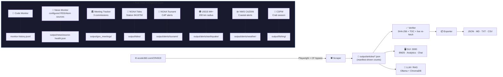

<p align="center">
  <h1 align="center">🌊 Crescent City Intelligence Platform</h1>
  <p align="center">
    <strong>Scrape · Verify · Export · View · Chat · Stream · Monitor · Alert · Analyze · Query</strong><br/>
    The most comprehensive local intelligence platform for the
    <a href="https://crescentcity.org">City of Crescent City, CA</a> —
    powered by <a href="https://ecode360.com/CR4919">ecode360.com/CR4919</a>
  </p>
  <p align="center">
    <a href="https://github.com/docxology/crescent-city-intel"></a>
    <a href="#-quick-start"></a>
    <a href="docs/modules/llm.md"></a>
    <a href="LICENSE"></a>
    <a href="#-test-suite"></a>
    <a href="#-commands-reference"></a>
  </p>
</p>

---

## 📋 Table of Contents

- [🏙️ About Crescent City, CA](#-about-crescent-city-ca)
- [✨ What This Does](#-what-this-does)
- [🏗️ Architecture](#-architecture)
- [🚀 Quick Start](#-quick-start)
- [🖥️ Web Viewer Features](#-web-viewer-features)
- [💬 LLM / RAG Chat](#-llm--rag-chat)
- [📡 Real-Time Monitoring & Alerts](#-real-time-monitoring--alerts)
- [📊 Analytics & Readability](#-analytics--readability)
- [🧭 Intelligence Domains](#-intelligence-domains)
- [📦 Export Formats](#-export-formats)
- [🌐 GitHub Pages Snapshot](#-github-pages-snapshot)
- [🔒 Integrity Guarantees](#-integrity-guarantees)
- [📂 Project Structure](#-project-structure)
- [📚 Municipal Code Structure](#-municipal-code-structure)
- [🧪 Test Suite](#-test-suite)
- [⚡ Commands Reference](#-commands-reference)
- [⚙️ Configuration](#-configuration)
- [📖 Documentation](#-documentation)
- [⚠️ Known Limitations](#-known-limitations)

---

## 🏙️ About Crescent City, CA

**Crescent City** is the county seat of **Del Norte County**, California — a coastal city of ~6,000 residents at **41.76°N, 124.20°W**, nestled between the Pacific Ocean and ancient redwood forests near the Oregon border.

### Quick Facts

| Fact | Detail |
| :--- | :--- |
| 🗺️ Location | Northernmost California coast, Del Norte County, 2 sq mi incorporated area |
| 👥 Population | ~6,046 (2024 est.) — includes ~3,000 inmates at Pelican Bay State Prison |
| 💰 Economy | Commercial crab fishing · harbor commerce · timber (historical) · tourism |
| 🌲 Natural Setting | [Redwood National & State Parks](https://www.nps.gov/redw/) · [Jedediah Smith Redwoods SP](https://www.parks.ca.gov/?page_id=413) · Smith River |
| 🏛️ Government | Mayor + City Council · Planning Commission · Harbor Commission |
| 🔐 Major employer | [Pelican Bay State Prison](https://www.cdcr.ca.gov/facility-locator/pbsp/) — maximum security, ~1,000 staff |
| 💧 Water | Precipitation ~70 in/yr · Smith River (last undammed major California river) |
| 🌊 Tsunami risk | **CRITICAL** — 1964 Good Friday Earthquake: 21 ft waves, 11 deaths, $17M damage |
| 🌍 Seismic risk | **HIGH** — Cascadia Subduction Zone can produce M9+ megathrust events |
| 🏠 Housing | 17% poverty rate · median income $35,540 · active homelessness response |

### 🌊 Tsunami Capital of California

Crescent City has experienced more significant tsunami impacts than any other US West Coast city. The **1964 Alaska Good Friday Earthquake (M9.2)** sent 21-foot waves through the harbor and downtown, killing 11 and destroying 289 city blocks. The city's unique harbor geometry — a natural funnel — amplifies distant Pacific tsunamis. The **Battery Point Lighthouse** (1856), located on a tidal island accessible only at low tide, survived; it now serves as a museum and tsunami education center.

Today, Crescent City operates a comprehensive tsunami preparedness program:
- Vertical evacuation structure: **Howland Hill Road** refuge
- **Del Norte Office of Emergency Services** coordinates with [CalOES](https://www.caloes.ca.gov/hazard-mitigation/tsunami/)
- **NOAA Pacific Tsunami Warning Center** (Palmer, AK) provides automated alerts
- Regular community drills and updated evacuation route signage

### 🔗 Key Civic & Government Resources

| Resource | URL | Notes |
| :--- | :--- | :--- |
| City of Crescent City | [crescentcity.org](https://crescentcity.org) | City Council agendas · permits · public notices |
| Municipal Code (live) | [ecode360.com/CR4919](https://ecode360.com/CR4919) | Official ordinance database |
| Del Norte County | [co.del-norte.ca.us](https://www.co.del-norte.ca.us/) | County Board of Supervisors · Clerk |
| Crescent City Harbor | [crescentcityharbor.com](https://crescentcityharbor.com) | Harbor Commission · fishing permits |
| Redwood National & State Parks | [nps.gov/redw](https://www.nps.gov/redw/) | Adjacent to city; major tourism driver |
| Battery Point Lighthouse | [delnortehistory.org](https://www.delnortehistory.org/battery-point-lighthouse/) | Historic 1856 lighthouse · tsunami museum |
| NOAA NWS Eureka (local forecasts) | [weather.gov/eka](https://www.weather.gov/eka/) | Coastal zone CAZ006 weather alerts |
| NOAA Pacific Tsunami Warning Center | [tsunami.gov](https://www.tsunami.gov) | Pacific Basin tsunami monitoring |
| USGS Earthquake Hazards | [earthquake.usgs.gov](https://earthquake.usgs.gov) | Cascadia Subduction Zone data |
| CalOES Tsunami Program | [caloes.ca.gov/tsunami](https://www.caloes.ca.gov/hazard-mitigation/tsunami/) | CA state tsunami preparedness |
| CDFW North Coast | [wildlife.ca.gov](https://wildlife.ca.gov/regions/1) | Dungeness crab · fishing regulations |
| Del Norte Unified School District | [delnorte.k12.ca.us](https://www.delnorte.k12.ca.us) | Public education |
| Pelican Bay State Prison | [cdcr.ca.gov/PBSP](https://www.cdcr.ca.gov/facility-locator/pbsp/) | Major employer; affects city demographics |

### 🏛️ How Crescent City Is Governed

The **Crescent City Code of Ordinances** governs daily life across 17 titles. Key governance bodies:

| Body | Responsibility | Meeting Frequency |
| :--- | :--- | :--- |
| **City Council** | Appropriations · ordinances · policy | 2nd & 4th Mondays |
| **Planning Commission** | Zoning · land use · building permits · CUPs | 1st Tuesday |
| **Harbor Commission** | Harbor leases · fishing facilities · dredging | 2nd Wednesday |

---

## ✨ What This Does

| Stage | Description | Tests | Docs |
| :---- | :---------- | :---: | :--: |
| 🕷️ **Scrape** | Refreshes a validated live TOC, rejects partial/challenge pages, and atomically resumes only hash- and section-complete article artifacts | ✓ | [→](docs/modules/scraping.md) |
| ✅ **Verify** | SHA-256 integrity checks + TOC cross-reference + live re-fetch sampling | ✓ | [→](docs/modules/verification.md) |
| 📦 **Export** | JSON · Markdown · plain text · CSV index | ✓ | [→](docs/modules/export.md) |
| 🖥️ **View** | Web viewer: TOC, BM25 search, analytics dashboard, dark/light mode | ✓ | [→](docs/modules/gui.md) |
| 💬 **Chat** | Ollama or OpenRouter chat with Ollama embeddings + ChromaDB · source citations (municipal code + YouTube transcripts) · RAG query logging | ✓ | [→](docs/modules/llm.md) |
| 📡 **Monitor** | Municipal code change detection + RSS/Atom news + government meeting tracking + YouTube meeting transcripts + Triplicate (Cloudflare), with per-source health | ✓ | [→](docs/modules/monitoring.md) |
| 📰 **Curate** | Source-grounded, bounded LLM summaries + domain tagging across news/meetings/YouTube with provider/model-aware retry-safe idempotency | ✓ | [→](docs/modules/monitoring.md) |
| 🚨 **Alert** | NOAA tsunami · USGS earthquake · NWS weather · NOAA tides · CDFW fishing · EPA AirNow · CAL FIRE · NDBC marine | ✓ | [→](docs/modules/alerts.md) |
| 📊 **Analyze** | Flesch-Kincaid readability scoring · Domain coverage metrics · PCA/K-Means analytics | ✓ | [→](docs/modules/gui.md) |
| 🌐 **Publish** | Bounded static snapshot for GitHub Pages with source health and provenance | ✓ | [→](docs/modules/pages.md) |
| 📝 **Manuscript** | Evidence-bound IMRAD paper with formal contracts, claim ledger, and template-rendered PDF/HTML | ✓ | [→](docs/manuscript.md) |

---

## 🏗️ Architecture


```mermaid
flowchart LR
    A["🌐 ecode360.com/CR4919"] -->|Playwright + CF bypass| B["🕷️ Scraper"]
    B --> C["📄 output/articles/*.json\n(manifest-driven counts)"]
    C --> D["✅ Verifier\nSHA-256 + TOC + live re-fetch"]
    D --> E["📦 Exporter"]
    E --> F["JSON · MD · TXT · CSV"]
    C --> G["🖥️ GUI :3000\nBM25 · Analytics · Chat"]
    C --> H["💬 LLM / RAG\nOllama + ChromaDB"]

    subgraph Intelligence["⚡ Real-Time Intelligence Layer"]
        J["📡 Code Monitor"] --> K["monitor-history.jsonl"]
        L["📰 News Monitor\nconfigured RSS/Atom sources"] --> M["output/news/source-health.json"]
        N["🏛️ Meeting Tracker\n3 commissions"] --> O["output/gov_meetings/"]
        P["🌊 NOAA Tides\nStation 9419750"] --> Q["output/tides/"]
        R["🌊 NOAA Tsunami\nCAP alerts"] --> S["output/alerts/tsunami/"]
        T["🌍 USGS M4+\n200 km radius"] --> U["output/alerts/earthquake/"]
        V["⛈️ NWS CAZ006\nCoastal alerts"] --> W["output/alerts/weather/"]
        X["🦀 CDFW\nCrab season"] --> Y["output/fishing/"]
    end

    style Intelligence fill:#1a1a2e,stroke:#4a90d9
```

> 📐 **Full architecture**: [docs/architecture.md](docs/architecture.md) — data flow diagram, module dependency graph, directory structure

---

## 🚀 Quick Start

### Prerequisites

| Tool | Version | Install |
| :--- | :------ | :------ |
| [Bun](https://bun.sh) | v1.0+ | `curl -fsSL https://bun.sh/install \| bash` |
| [Playwright](https://playwright.dev) | auto | `bun x playwright install chromium` |
| [Ollama](https://ollama.ai) | any | [ollama.ai/download](https://ollama.ai/download) — embeddings and default local chat; still required for retrieval when OpenRouter handles chat |
| [ChromaDB](https://trychroma.com) | any | `pip install chromadb` — for RAG chat only |

### Install & Run

```bash
# 1. Clone and install
git clone https://github.com/docxology/crescent-city-intel.git
cd crescent-city-intel
bun install

# 2. Run the full pipeline: scrape → verify → export
bun run all

# 3. Launch the web viewer
bun run gui          # → http://localhost:3000

# 4. Run all tests (authoritative release gate)
bun run validate
```

> 📖 **Detailed setup**: [docs/setup.md](docs/setup.md) — step-by-step from prerequisites through RAG chat

---

## 🎛️ Interactive Menu (`run.sh`)

The top-level `run.sh` provides a **full interactive text menu** covering every project feature:

```bash
./run.sh          # Interactive menu
./run.sh gui      # Launch web viewer directly
./run.sh test     # Run test suite directly
./run.sh setup    # Install dependencies + Playwright
./run.sh status   # System status dashboard
./run.sh api-test # Test all API endpoints (requires running GUI)
```

Menu sections:

| Section | Options |
| :------ | :------ |
| **Setup & Data Pipeline** | Install deps · Run tests · Scrape · Verify · Export |
| **Web Interface** | Launch GUI → browser · Test 12 API endpoints live |
| **AI / RAG** | Index ChromaDB · Interactive chat · Single query · Status · Pull models |
| **Monitoring & Alerts** | Code monitor · News (configured RSS/Atom feeds) · Gov meetings · Tides · Fishing · Tsunami · Earthquake · Weather · All alerts · Weekly check |
| **Analytics** | Readability scoring · Domain coverage · JSON summary views · RAG query log |
| **Full Pipeline** | Auto: Setup → Test → Scrape → Verify → Export → GUI in one shot |

The API tester (`option 7`) live-checks 12 endpoints and reports HTTP status codes:

```
  /api/health                    HTTP 200  server/provider/source health
  /api/domains                   HTTP 200  array len=6
  /api/search?q=tsunami&limit=3  HTTP 200  keys:query,total,offset,limit,count
  /api/domains/coverage          HTTP 200  keys:computedAt,totalSections,...
  /api/readability               HTTP 200  keys:computedAt,totalSections,...
  /api/monitor/alerts            HTTP 200  keys:fetchedAt,alerts
```

---

## 🖥️ Web Viewer Features

Launch with `bun run gui` → open **<http://localhost:3000>**:

| Feature | Description |
| :------ | :---------- |
| 📋 **TOC Tree** | Collapsible table of contents with manifest-driven titles, articles, and sections |
| 📖 **Section Viewer** | Formatted legal text with legislative history and cross-references |
| 🔍 **BM25 Search** | Full-text search with Porter stemming, title-scoped filters, `<mark>` highlight, pagination |
| 🌗 **Dark / Light Mode** | Toggle between themes, persisted in `localStorage` |
| ✨ **AI Summaries** | Per-section legal summaries generated on-demand via the configured chat provider |
| 💬 **RAG Chat** | Natural-language questions answered with cited code sections (GET & POST) |
| 📊 **Analytics Dashboard** | Bar charts (sections/words per Title) · PCA scatter plot · K-Means · word loadings |
| 📈 **Readability** | Flesch-Kincaid grade level for every section; hardest/easiest ranking |
| 🧭 **Domains Panel** | 12 intelligence domains — each cross-referenced to specific code sections |
| 📡 **Monitor Status** | Live view of latest change-detection report + alert aggregation |
| 🌊 **Tides & Alerts** | Current NOAA CO-OPS tide predictions and hazard alert status |

> 🔧 **GUI internals**: [docs/modules/gui.md](docs/modules/gui.md) — all API routes, search engine, analytics pipeline

---

## 💬 LLM / RAG Chat

```bash
# Start prerequisites
ollama serve &
chroma run --path chroma_data &

# Pull required models
ollama pull nomic-embed-text    # embeddings
ollama pull gemma3:4b           # chat / summarization

# Index every section in the current scrape into ChromaDB
bun run index

# Interactive chat session
bun run chat

# Single query (GET)
bun run query "What are the tsunami evacuation requirements?"
bun run query "What are the zoning setback requirements for residential areas?"
bun run query "What permits are required to operate a commercial fishing vessel from the harbor?"

# POST API (for long questions)
curl -X POST http://localhost:3000/api/chat \
  -H "Content-Type: application/json" \
  -d '{"q": "Summarize all sections in Title 17 related to coastal zone management"}'
```

The RAG pipeline:
1. Embeds questions via `nomic-embed-text` (768-dim vectors)
2. Retrieves top-10 most relevant chunks from ChromaDB using cosine similarity
3. Generates cited answers via `gemma3:4b` with section number references
4. Returns a query ID, grounding flag, context fingerprint, retrieval count,
   provider/model, embedding model, and Chroma collection; query telemetry is
   logged to `output/rag-queries.jsonl`

> 🔧 **LLM internals**: [docs/modules/llm.md](docs/modules/llm.md) — config, chunking strategy, embedding pipeline

---

## 📡 Real-Time Monitoring & Alerts

### Municipal Code Change Monitor

Detects upstream changes on ecode360.com by comparing SHA-256 hashes and section counts against the last known good scrape.

```bash
bun run monitor         # check for changes → output/monitor-history.jsonl
```

### News Monitor (configured RSS/Atom sources)

Aggregates local NorCal news feeds, filtering for Crescent City-relevant content. Uses persistent deduplication across runs via `output/state/news-seen-ids.json` and writes per-source health diagnostics.

```bash
bun run news                            # all keywords
bun run news -- --keywords="tsunami,earthquake,harbor"  # targeted keywords
```

### Source discovery and coverage boundary

`src/source_registry.ts` is the authoritative inventory for Crescent City and
Del Norte County online information. It records canonical URLs, authority,
region, provenance, collection mode, and whether a source is `monitored`,
`discovery-only`, or `reference-only`. Discovery-only entries are intentionally
visible gaps rather than false-success monitors.

```bash
bun run source-discovery             # deterministic inventory + known health joins
bun run source-discovery -- --check  # bounded live GET probes; outages are recorded
```

The idempotent artifacts are `output/source-registry.json`,
`output/source-discovery.json`, and `output/state/source-discovery-seen.json`.
Their fingerprint and coverage gaps are included in the local GUI Source Coverage
workspace, `/api/sources`, `/api/source-discovery`, monthly reports, and GitHub
Pages exports. The GUI and Pages dashboard can inspect individual records and
download filtered JSON/CSV envelopes without losing status or provenance.

The local GUI and public Pages landing views are welcome linktrees: visitors
can choose local news and source-grounded summaries, source freshness, the
municipal code, safety alerts, analytics, civic reports, structured downloads,
or official local source hubs before entering the deeper tools.

**Sources**: Lost Coast Outpost · Humboldt County official news · KIEM-TV/NBC 3 via current Redwood News RSS/HTML fallbacks · Redwood Voice · North Coast Journal. The feed set is intentionally local- and civic-specific; broad regional wire coverage is excluded.

**Filter keywords**: crescent city · del norte · tsunami · harbor · fishing · crabbing · pelican bay · evacuation · wildfire · zoning · ordinance...

### Government Meeting Tracker

Scrapes city websites for agendas and minutes from all three commissions.

```bash
bun run gov-meetings    # → output/gov_meetings/
```

**Tracked**: City Council · Planning Commission · Harbor Commission

### 🌊 NOAA CO-OPS Tides (Station 9419750)

Real-time tide predictions for Crescent City Harbor — the exact same station used by harbor pilots and fishing vessels.

```bash
bun run alerts:tides    # 48h predictions · current water level · 7 ft MLLW alert
```

Station 9419750 coordinates: **41.745°N, 124.184°W** — [NOAA Tides Online](https://tidesandcurrents.noaa.gov/stationhome.html?id=9419750)

### 🦀 CDFW Dungeness Crab Season Monitor

Tracks California's annual Dungeness crab season calendar and CDFW North Coast marine bulletins for domoic acid or entanglement delays.

```bash
bun run alerts:fishing  # → output/fishing/fishing-status.json
```

Season calendar (California North Coast):
- **Commercial**: Opens ~ November 15 · Closes June 30
- **Recreational**: Opens ~ November 4 · Closes July 30

### Hazard Alert Monitors

```bash
bun run alerts:tsunami      # NOAA CAP → Tsunami Warning events for California coast
bun run alerts:earthquake   # USGS GeoJSON → M4.0+ within 200 km of Crescent City
bun run alerts:weather      # NWS → Del Norte coastal zone CAZ006 advisories
bun run alerts              # all concurrently
bun run weekly-check        # full health-check + summary report
bun run cron-setup          # install as weekly scheduled job (macOS/Linux)
```

| Alert Type | Source | Threshold |
| :--------- | :----- | :-------- |
| Tsunami | NOAA `api.weather.gov/alerts` | Any Tsunami Warning for California |
| Earthquake | USGS `earthquake.usgs.gov` Feed | M4.0+ within 200 km, Cascadia Subduction Zone priority |
| Weather | NWS Eureka office, zone CAZ006 | Coastal flood advisory · high wind · storm surge |
| Tides | NOAA CO-OPS Station 9419750 | ≥7.0 ft MLLW current water level (storm surge / king tide) |

> 🔧 **Monitor internals**: [docs/modules/monitoring.md](docs/modules/monitoring.md) · [docs/modules/alerts.md](docs/modules/alerts.md)

---

## 📊 Analytics & Readability

### Flesch-Kincaid Readability Scoring

Every section of the municipal code is scored for reading difficulty. Crescent City's code includes both plain-language notices and dense legal text.

```bash
bun run readability        # score all sections → output/readability.json
                           # also available at GET /api/readability
```

| Difficulty | Grade Level | Examples in Crescent City Code |
| :--------- | :---------- | :----------------------------- |
| **Plain** | < 8 | Short animal control definitions, simple fee schedules |
| **Standard** | 8–12 | Traffic regulations, permit application requirements |
| **Complex** | 12–16 | Zoning conditional use permits, building code sections |
| **Legal** | > 16 | Environmental impact language, subdivision regulations |

### Domain Coverage Metrics

Compute what percentage of the current manifest's sections is cross-referenced by each of the 12 intelligence domains.

```bash
bun run coverage           # → output/domain-coverage.json
                           # also available at GET /api/domains/coverage
```

---

## 🧭 Intelligence Domains

The project maps the municipal code to **12 civic intelligence domains**, each cross-referenced to specific sections with external resource links:

| Domain | Icon | Key Topics | Key Code Titles |
| :----- | :--- | :--------- | :-------------- |
| Emergency Management | 🌊 | Tsunami evacuation · Cascadia earthquake · EOC · mutual aid | 8, 9, 12 |
| Business & Economic Dev | 🦀 | Harbor permits · fishing licenses · tourism · crab season | 3, 5, 13 |
| Public Safety & Justice | 🚔 | Police · corrections · Pelican Bay · crime prevention | 9, 10 |
| Public Health & Safety | 🏥 | EMS · food safety · mental health/CARE Court | 6, 8, 9 |
| Environment & Conservation | 🌲 | Coastal zone management · redwoods · wildlife · waste | 8, 13, 17 |
| Infrastructure & Services | 🏗️ | Utilities · roads · parks · building permits · zoning | 12, 13, 15, 16, 17 |
| Housing & Homelessness | 🏠 | Affordable housing · emergency shelter · vehicle dwelling · CARE Court | 8, 13, 15, 16, 17 |
| Harbor & Marine Operations | ⚓ | Harbor commerce · dredging · fishing fleet · waterfront | 3, 5, 13 |
| Event Planning & Tourism | 🎪 | Special events · film permits · tourism promotion | 5, 9 |
| Education & Youth | 📚 | School district · youth programs · library | 2, 9 |
| Climate & Environment | 🌡️ | Sea-level rise · drought/water conservation · air quality | 8, 17 |
| Demographics & Social Indicators | 📊 | Population profile · poverty · homelessness trends | 6, 8, 9 |

**External cross-references per domain:**

- 🌊 Emergency: [CalOES Tsunami](https://www.caloes.ca.gov/hazard-mitigation/tsunami/) · [NOAA PTWC](https://www.tsunami.gov) · [Del Norte OES](https://www.co.del-norte.ca.us/)
- 🦀 Business: [Crescent City Harbor](https://crescentcityharbor.com) · [CDFW North Coast](https://wildlife.ca.gov/regions/1)
- 🌲 Environment: [Redwood NPS](https://www.nps.gov/redw/) · [California Coastal Commission](https://www.coastal.ca.gov/)
- 🏠 Housing: [CalHFA](https://www.calhfa.ca.gov/) · [HUD California](https://www.hud.gov/states/california) · [CARE Court](https://carecourt.ca.gov/)

---

## 📦 Export Formats

| Format | Output | Description |
| :----- | :----- | :---------- |
| **JSON** | `output/crescent-city-code.json` | All sections in the current manifest with metadata, GUIDs, and hashes |
| **Markdown** | `output/markdown/` | Organized by Title/Chapter with cross-links |
| **Text** | `output/crescent-city-code.txt` | Plain text corpus for NLP/LLM training |
| **CSV** | `output/section-index.csv` | Section index with GUIDs for cross-referencing |
| **Readability** | `output/readability.json` | Flesch-Kincaid scores for all sections in the current manifest |
| **Coverage** | `output/domain-coverage.json` | Domain cross-reference coverage % |
| **Geo-Intel** | `pages-data/geo-intel.json` + `output/geo-intel.json` | Transferable machine-readable municipality contract (Crescent City default civic + hazard) for geospatial consumers (GEO-INFER) |
| **RAG Log** | `output/rag-queries.jsonl` | All RAG queries with latency and sources |
| **Pipeline run** | `output/state/latest-pipeline-run.json` | Stage-level status, duration, output paths, and source-health summary |
| **Curation run** | `output/state/curation-report.json` | Provider/model, success counts, fingerprints, and retryable failures |
| **Report metadata** | `output/reports/monthly-YYYY-MM.json` | Period bounds, numeric metrics, warnings, and health |

> 🔧 **Export details**: [docs/modules/export.md](docs/modules/export.md)

---

## 🌐 GitHub Pages Snapshot

The repository publishes a static snapshot from `.github/workflows/pages.yml`.
Configured public target: <https://docxology.github.io/crescent-city-intel/>.
The workflow runs the deterministic release gate, collects the live monitors,
and exports `.pages/` with provenance-aware source health. Source state is
exported separately from pipeline state: `ok` and `empty` are present checks,
while `unavailable` and `stale` are named coverage gaps. A source gap does
not make an otherwise complete snapshot `degraded`, and it is never rendered
as an unexplained calm state.

The public artifact includes the municipal-code export when present, source
health, recent news and meeting items, alert snapshots, source-grounded
curation, and the latest civic report. It excludes API keys, chat/request/
search/RAG logs, Chroma data, and Triplicate article content. Triplicate
metadata is reference/citation-only and is not an input to curation, embeddings,
or training.

The static dashboard remains interactive without a backend: filter source
health by state, filter public items by text, search the exported code locally,
refresh the immutable snapshot, and inspect pipeline/provider/report metadata.

```bash
bun run pages:export -- --source output --seed pages-data --output .pages
bun run pages:validate -- .pages
```

`pages-data/` is the reviewed public seed for the municipal-code snapshot;
refresh it after a verified scrape with `bun run pages:seed`.

See [the Pages module guide](docs/modules/pages.md) for deployment triggers,
artifact boundaries, and local preview instructions.

---

## 🔒 Integrity Guarantees

- 🔐 Every article page **SHA-256 hashed** at scrape time (async, WebCrypto API)
- 🔄 Verification **re-computes hashes** from saved files and compares against manifest
- 📋 Every section in the official TOC **cross-referenced** against scraped data
- 🌐 Random sample of 5 pages **re-fetched from live site** to confirm byte-level freshness
- ⏱️ Manifest records **exact timestamps** for audit trail
- 💾 **Resume support** — interrupt and restart safely; only exact current-TOC artifacts are skipped
- 🧱 **Atomic artifacts** — TOC, article, manifest, and curation outputs are replaced without truncated JSON
- 🧭 **TOC provenance** — manifest records a TOC fingerprint plus live/cached source

> 🔧 **Verification details**: [docs/modules/verification.md](docs/modules/verification.md)

---

## 📂 Project Structure

```text
  src/
  types.ts              # All TypeScript interfaces (TocNode, FlatSection, ScrapeManifest…)
  constants.ts          # URLs, paths, rate limits (env-overridable)
  utils.ts              # Hash, flatten, chunk, truncate, sleep, retry, htmlToText…
  logger.ts             # Structured logger (LOG_LEVEL env variable)
  browser.ts            # Playwright lifecycle + Cloudflare bypass
  toc.ts                # TOC fetcher + tree utilities
  content.ts            # Page scraper + section extraction
  scrape.ts             # Scraper orchestrator with resume
  scraper_utils.ts      # TOC/artifact validation and retry utilities
  verify.ts             # Verification engine
  export.ts             # Multi-format exporter (JSON, MD, TXT, CSV)
  domains.ts            # 12 civic intelligence domains with code cross-refs
  monitor.ts            # Municipal code change detection
  news_monitor.ts       # RSS/Atom news aggregator (configured sources + health + persistent dedup)
  gov_meeting_monitor.ts # City Council/Planning/Harbor meeting tracker (EvoGov JSON API)
  youtube_monitor.ts    # YouTube listing + auto-caption transcript pipeline (yt-dlp)
  triplicate_monitor.ts # Reference/citation-only Del Norte Triplicate monitor (Playwright)
  curation.ts           # LLM provider-aware, source-grounded curation with domain tagging
  source_registry.ts    # Canonical online source inventory + bounded discovery probes
  monthly_report.ts     # Monthly civic health report generator
  analytics_backend.ts  # Cross-surface analytics envelope (GUI, pipeline, Pages)
  alert_analytics.ts    # Unified 8-monitor alert timeline + per-type statistics
  structured_queries.ts # Legislative history, section compare, semantic similarity
  legal_parser.ts       # Citation extractor, glossary builder, ordinance parser
  manuscript_variables.ts # Durable manuscript variable extraction from analytics
  alerts/
    severity.ts         # Composite 8-monitor alert severity scoring
    noaa_tsunami.ts     # NOAA CAP tsunami warning monitor
    noaa_tides.ts       # NOAA CO-OPS tides (station 9419750, 48h predictions)
    usgs_earthquake.ts  # USGS earthquake monitor (M4.0+, 200 km, Cascadia)
    nws_weather.ts      # NWS Del Norte coastal zone CAZ006 alerts
    cdfw_fishing.ts     # CDFW Dungeness crab season calendar + bulletin monitor
    epa_airnow.ts       # EPA AirNow air quality monitor (PM2.5, ozone, PM10 AQI)
    calfire_wildfire.ts # CAL FIRE wildfire incident monitor
    ndbc_marine.ts      # NDBC marine buoy monitor (wave, wind, water temp)
  api/
    middleware.ts       # Sliding-window rate limiter · API key auth · request log
  domains/
    coverage.ts         # Domain coverage % with prefix matching across the current manifest
  shared/
    paths.ts            # Centralized output path constants
    data.ts             # Data loading layer (60s TTL cache, parallel, actionable errors)
    porter_stem.ts      # Zero-dep Porter stemmer (Steps 1a-5b) for BM25 indexing
    readability.ts      # Flesch-Kincaid Grade Level + Reading Ease + Gunning Fog
    fuzzy.ts            # Levenshtein fuzzy matching + typo correction
    idempotency.ts      # Shared (id, contentHash)-keyed idempotency store for all monitors
    orchestration.ts    # Durable step/run envelopes, build metadata, and run IDs
    source_health.ts    # Typed source-health contract, atomic artifact writes, freshness
  gui/
    server.ts           # Bun.serve() HTTP server (port 3000)
    routes.ts           # All /api/* route handlers (see openapi.yaml)
    search.ts           # In-memory BM25 full-text search (stemmed, paginated, fuzzy fallback)
    analytics.ts        # PCA, K-Means, word loadings analytics
    static/index.html   # Single-page app (no framework, no build step)
  llm/
    config.ts           # LLM configuration (models, chunk sizes, topK, rate spacing)
    provider.ts         # Ollama/OpenRouter chat-provider selection + health check
    ollama.ts           # Ollama API wrapper (embed, chat, health check)
    openrouter.ts       # OpenRouter API wrapper with model validation
    chroma.ts           # ChromaDB client (collections, add, query)
    embeddings.ts       # Chunk → embed → index pipeline (fingerprinted, stale-chunk deletion)
    rag.ts              # RAG pipeline (embed → retrieve → generate → log, adaptive topK)
    streaming_rag.ts    # SSE streaming RAG (provider-native Server-Sent Events)
    index.ts            # CLI entry point (index, chat, query, status, preflight)
  pages_snapshot.ts     # Bounded public GitHub Pages static snapshot exporter
  pages/static/         # Static dashboard and 404 fallback for Pages
scripts/
  weekly-check.ts       # Weekly health check orchestrator (all monitors + composite)
  run-alerts.ts         # Alert monitor runner (concurrent 8-monitor composite)
  run-monitor.ts        # Change detection runner
  run-news.ts           # News monitor runner (--keywords= CLI flag)
  run-meetings.ts       # Meeting monitor runner
  run-youtube.ts        # YouTube listing/transcript pipeline runner
  run-curation.ts       # Provider-aware grounded curation runner
  run-analytics.ts      # Analytics overview runner
  run-coverage.ts       # Domain coverage analysis orchestrator
  run-readability.ts    # Readability scoring orchestrator
  run-source-discovery.ts # Source registry + bounded probe runner
  export-pages.ts       # Build the bounded .pages public snapshot
  refresh-pages-data.ts # Refresh the verified tracked municipal-code seed
  validate-pages.ts     # Validate the generated Pages artifact
  validate.ts           # Authoritative deterministic release gate
  validate-manuscript.ts # Manuscript source contract + evidence checks
  hydrate-manuscript.ts # Write evidence-bound manuscript into output/manuscript/
  repair-output.ts      # Historical output repair/quarantine utility
  z_generate_manuscript_variables.py # Python manuscript-variable generation for template render
  cron-setup.sh         # macOS Launchd / Linux cron installer
  weekly-check.sh       # Shell entry point for weekly check
tests/                  # deterministic zero-mock suite; run `bun run validate` for the current count
docs/                   # Full module documentation suite
manuscript/             # Evidence-bound IMRAD paper with formal contracts and claim ledger
pages-data/             # Reviewed public seed artifacts for static Pages
output/                 # Scraped data + reports (gitignored)
.pages/                 # Generated static GitHub Pages snapshot (gitignored)
openapi.yaml            # OpenAPI 3.0.3 spec (v2.5.1)
```

---

## 📚 Municipal Code Structure

The **Crescent City Code of Ordinances** is served from the current scraped manifest, including its titles, articles, and sections:

<details>
<summary><strong>📜 View all 17 titles + appendices</strong></summary>

| Title | Subject | Chapters | Key Topics for Crescent City |
| :---- | :------ | :------: | :--------------------------- |
| 1 | General Provisions | 7 | Definitions, incorporation history |
| 2 | Administration & Personnel | 14 | City Manager, departments, elections |
| 3 | Revenue and Finance | 8 | Fees, taxes, budget process |
| 4 | *(Reserved)* | — | — |
| 5 | Business Taxes & Licenses | 26 | Harbor business licenses, fishing permits |
| 6 | Animal Control | 3 | Wildlife interactions (bears, deer) |
| 7 | *(Reserved)* | — | — |
| 8 | Health and Safety | 12 | Tsunami preparedness, emergency shelters, camping |
| 9 | Public Peace & Welfare | 6 | Pelican Bay operations, public safety |
| 10 | Vehicles and Traffic | 16 | Harbor access roads, downtown parking |
| 11 | *(Reserved)* | — | — |
| 12 | Streets & Sidewalks | 14 | Coastal access, stormwater |
| 13 | Public Services | 16 | Utilities, harbor services, sewer |
| 14 | Procurement Procedures | 8 | Contracting, competitive bidding |
| 15 | Buildings & Construction | 12 | Coastal zone construction, tsunami-resistant design |
| 16 | Subdivisions | 10 | Coastal subdivisions, lot splits |
| 17 | Zoning | 25 | Coastal overlay zones, harbor commercial, redwood buffer |

**Plus**: Appendix A (Employer-Employee Relations), Appendix B (Sewer Manual), Statutory References, Cross Reference Table, Ordinance List

</details>

---

## 🧪 Test Suite

```
Run `bun run validate` for the current pass/fail result. The suite uses real
functions and local HTTP fixtures; external live smoke checks are separate.
```

The test matrix is intentionally generated by the test runner rather than
duplicated here. This prevents documentation from claiming stale per-file
counts as modules evolve. Run `bun test` for the authoritative total and
`bun run validate` for the complete release gate.

Run tests:

```bash
bun test              # deterministic suite
bun run validate      # strict TypeScript + tests + contract/output checks
bun test tests/search.test.ts   # single file
```

---

## ⚡ Commands Reference

### Core Pipeline

| Command | Description |
| :------ | :---------- |
| `bun install` | Install all dependencies |
| `bun run scrape` | Scrape municipal code (resumable, Cloudflare bypass). `--full-rescrape` re-fetches every article, bypassing the resume cache |
| `bun run verify` | Verify SHA-256 integrity + TOC cross-reference |
| `bun run export` | Export to JSON, Markdown, TXT, CSV |
| `bun run all` | Scrape → Verify → Export (full pipeline) |
| `bun run gui` | Web viewer → http://localhost:3000 |

### AI / RAG

| Command | Description |
| :------ | :---------- |
| `bun run index` | Index every section in the current scrape into ChromaDB |
| `bun run chat` | Interactive RAG chat (configured provider; Ollama by default) |
| `bun run query "..."` | Single RAG query |
| `bun run status` | Check Ollama / ChromaDB / index status |

### Monitoring & Alerts

| Command | Description |
| :------ | :---------- |
| `bun run monitor` | Detect municipal code changes |
| `bun run news` | Fetch local news RSS (--keywords= flag supported) |
| `bun run source-discovery` | Inventory canonical sources; add `-- --check` for bounded probes |
| `bun run gov-meetings` | Scrape city meeting agendas/minutes |
| `bun run alerts` | Run all alert monitors concurrently |
| `bun run alerts:tsunami` | Poll NOAA CAP tsunami warnings |
| `bun run alerts:earthquake` | Poll USGS earthquake feed (M4.0+, 200 km) |
| `bun run alerts:weather` | Poll NWS coastal weather alerts (CAZ006) |
| `bun run alerts:tides` | NOAA CO-OPS tides (station 9419750, 48h) |
| `bun run alerts:fishing` | CDFW crab season + marine bulletins |
| `bun run weekly-check` | Full weekly health check + summary report |
| `bun run cron-setup` | Install weekly-check as OS scheduled job |
| `bun run pages:export` | Build a bounded static snapshot from `output/` |
| `bun run geo:intel` | Build the machine-readable municipality contract (Crescent City default civic + hazard; `pages-data/geo-intel.json` + `output/geo-intel.json`) |
| `bun run pages:seed` | Refresh the tracked verified municipal-code seed |
| `bun run pages:validate` | Validate snapshot schema, health truthfulness, and public boundaries |

### Analysis

| Command | Description |
| :------ | :---------- |
| `bun run readability` | Flesch-Kincaid scoring → `output/readability.json` |
| `bun run coverage` | Domain coverage % → `output/domain-coverage.json` |
| `bun run analytics` | Shared deterministic overview → `output/state/analytics-overview.json` with optional LLM executive summary |
| `bun run manuscript:check` | Validate IMRAD structure, citations, labels, claim ledger, and source tokens |
| `bun run manuscript:hydrate` | Resolve manuscript tokens from the canonical analytics overview |
| `bun test` | Run the deterministic test suite |
| `bun run test:coverage` | Run the deterministic suite with coverage |
| `bun run test:browser` | Headless-Chromium smoke test of the running GUI (requires Playwright browser) |

---

## 🌐 API Reference

The GUI server (`bun run gui`) exposes a REST API at `http://localhost:3000`:

| Endpoint | Method | Description |
| :------- | :----- | :---------- |
| `/api/toc` | GET | Full TOC tree |
| `/api/article/:guid` | GET | Article with all sections |
| `/api/section/:guid` | GET | Single section |
| `/api/search?q=...&title=8&type=section&highlight=true&offset=0&limit=50` | GET | BM25 search (paginated, stemmed, filtered) |
| `/api/sections?title=8&chapter=04` | GET | Hierarchical section listing |
| `/api/chat?q=...` | GET | RAG query (short questions) |
| `/api/chat` | POST | RAG query (`{q}` JSON body, long questions) |
| `/api/summarize` | POST | Configured-provider section summarizer |
| `/api/stats` | GET | Scrape statistics |
| `/api/domains` | GET | All 12 intelligence domains |
| `/api/domain/:id` | GET | Domain detail with topic cross-refs |
| `/api/domain/:id/sections` | GET | Domain → code section map |
| `/api/domains/coverage` | GET | Domain coverage % report |
| `/api/domains/search?q=...` | GET | Search across domains |
| `/api/readability` | GET | Flesch-Kincaid scores (all sections) |
| `/api/analytics/overview` | GET | Canonical cross-surface signal, metrics, warnings, source boundaries, and optional LLM executive summary |
| `/api/analytics/stats` | GET | Word counts, length extremes |
| `/api/analytics/embeddings` | GET | PCA projection (requires ChromaDB) |
| `/api/monitor/status` | GET | Latest monitor report |
| `/api/monitor/history` | GET | Monitor history JSONL |
| `/api/monitor/alerts` | GET | Aggregated alert status (all 8 monitors) |
| `/api/metadata` | GET | Build, provider, artifact, and source-lineage metadata |
| `/api/sources` | GET | Canonical source registry, coverage boundaries, and health joins |
| `/api/sources?format=csv` | GET | Flat downloadable source coverage table |
| `/api/source-discovery` | GET | Fingerprinted discovery report and explicit coverage gaps |
| `/api/curation/status` | GET | Latest curation provider/model and retry metadata |
| `/api/report/latest.json` | GET | Machine-readable latest report metadata |
| `/api/health` | GET | Server health check |

> 📋 **Full API spec**: [openapi.yaml](openapi.yaml) (OpenAPI 3.0.3, v2.5.1)

---

## ⚙️ Configuration

All settings support environment variable overrides:

| Variable | Default | Description |
| :------- | :------ | :---------- |
| `PORT` | `3000` | GUI server port |
| `LOG_LEVEL` | `info` | Logger verbosity (`debug`, `info`, `warn`, `error`) |
| `OLLAMA_URL` | `http://localhost:11434` | Ollama API endpoint |
| `EMBEDDING_MODEL` | `nomic-embed-text` | Embedding model for RAG |
| `CHAT_MODEL` | `gemma3:4b` | Ollama chat / summarization model |
| `LLM_PROVIDER` | `ollama` | Chat provider: `ollama` or `openrouter` |
| `LLM_PREFLIGHT_TIMEOUT_MS` | `5000` | Selected-provider health-check timeout |
| `SOURCE_FRESHNESS_WINDOW_MS` | `86400000` | Maximum age before a fetched source is marked stale |
| `ALERT_WEBHOOK_URL` | _(unset)_ | Optional URL; POSTs on composite alert WARNING/EMERGENCY |
| `RERANK_ENABLED` | `false` | Enable the post-retrieval lexical-hybrid rerank in RAG |
| `RERANK_TOP_N` | `5` | Chunks retained by the rerank (RERANK_ENABLED=true) |
| `OPENROUTER_API_KEY` | unset | Required only for OpenRouter chat/curation |
| `OPENROUTER_URL` | `https://openrouter.ai/api/v1` | OpenRouter API base URL |
| `OPENROUTER_MODEL` | `inclusionai/ling-3.0-flash:free` | OpenRouter chat model |
| `OPENROUTER_MAX_TOKENS` | `1024` | Maximum tokens per OpenRouter completion |
| `OPENROUTER_MAX_REQUESTS` | `100` | Per-process OpenRouter request cap |
| `OPENROUTER_MIN_REQUEST_INTERVAL_MS` | `3100` | Minimum spacing between OpenRouter requests |
| `OPENROUTER_TIMEOUT_MS` | `120000` | OpenRouter request timeout |
| `CURATION_SUMMARY_TIMEOUT_MS` | `15000` | Maximum time for one curation summary before source-only fallback |
| `CHROMA_URL` | `http://localhost:8001` | ChromaDB server endpoint |
| `CRESCENT_CITY_API_KEY` | _(random per-boot)_ | API key (comma-separated for multiple) |
| `RATE_LIMIT_MS` | `2000` | Min ms between requests to ecode360 (scraper) |
| `SCRAPE_TIMEOUT_MS` | `60000` | Playwright page navigation timeout |

> 🔧 **Full configuration reference**: [docs/configuration.md](docs/configuration.md)

---

## 📖 Documentation

| Document | Description |
| :------- | :---------- |
| 🚀 [Setup Guide](docs/setup.md) | Step-by-step: install, scrape, view, chat |
| 📐 [Architecture](docs/architecture.md) | System design, data flow, module dependency graph |
| 📋 [API Reference](docs/api-reference.md) | All exported functions, interfaces, and types |
| ⚙️ [Configuration](docs/configuration.md) | Environment variables, constants, tuning |
| 🗺️ [Roadmap](docs/roadmap.md) | Feature backlog and progress tracking |
| 🕷️ [Scraping](docs/modules/scraping.md) | Browser, TOC, content extraction |
| ✅ [Verification](docs/modules/verification.md) | SHA-256 checks, section presence, live re-fetch |
| 📦 [Export](docs/modules/export.md) | JSON, Markdown, plain text, CSV |
| 🖥️ [GUI](docs/modules/gui.md) | Web viewer, API routes, search, analytics |
| 💬 [LLM](docs/modules/llm.md) | Ollama, ChromaDB, embeddings, RAG pipeline |
| 🔗 [Shared](docs/modules/shared.md) | Path resolution, data loading, porter stemmer, readability |
| 📝 [Logger](docs/modules/logger.md) | Structured logging, LOG_LEVEL |
| 🧭 [Domains](docs/modules/domains.md) | 12 civic intelligence domains, coverage metrics |
| 📡 [Monitoring](docs/modules/monitoring.md) | Code change, configured news sources, meetings, YouTube, Triplicate, curation |
| 🚨 [Alerts](docs/modules/alerts.md) | All 8 monitors with availability-aware severity |
| 🌐 [GitHub Pages](docs/modules/pages.md) | Static snapshot export and deployment |
| 🔐 [API Middleware](docs/modules/api.md) | Sliding-window rate limiting, API key auth |

---

## ⚠️ Known Limitations

- **Cloudflare Turnstile** — scraper runs non-headless Chromium; timing can vary; re-run if stuck
- Intermediate `part` and `subarticle` TOC nodes are not themselves scrapable pages; their child sections are collected recursively
- **Content changes** on ecode360 are not auto-detected — re-scrape and re-run `bun run verify` to refresh
- **Local LLM answer quality** depends on the Ollama chat model — larger models (e.g., `llama3:8b`) give better results than `gemma3:4b`; OpenRouter quality depends on the selected remote model
- **Rate-limit in-memory store** resets on server restart — not suitable for multi-instance deployments without shared cache (e.g., Redis)
- **CDFW crab season** is estimated by regulatory calendar — check [CDFW North Coast bulletins](https://wildlife.ca.gov/regions/1) for emergency closures (domoic acid, whale entanglement)
- **Tsunami monitor** fetches active CAP alerts — no historical data without archiving
- **CAL FIRE wildfire API** — the retired `fire.ca.gov/imap/imapdata/all` endpoint was blocked, so the monitor now uses the current official incident JSON endpoint linked from the [CAL FIRE incidents page](https://www.fire.ca.gov/incidents); a valid empty Del Norte-region result is reported as `empty`, not unavailable
- **Government meeting tracker** — the legacy commission agenda URLs are retired. The monitor now uses the city's live EvoGov JSON endpoint (`crescentcity.org/meetings/get_list`); City Council and Planning Commission items were live in the 2026-07-24 smoke run, while Harbor Commission currently has no matching records and remains explicitly `empty` in source health.

---

<p align="center">
  Made with ❤️ for civic transparency in Crescent City, California<br/>
  <a href="LICENSE">CC BY-SA 4.0</a> ·
  <a href="CONTRIBUTING.md">Contributing</a> ·
  <a href="docs/setup.md">Setup</a> ·
  <a href="docs/README.md">Documentation</a> ·
  <a href="https://crescentcity.org">crescentcity.org</a> ·
  <a href="https://ecode360.com/CR4919">ecode360.com/CR4919</a>
</p>

## LifeOS / Pulse integration

This platform feeds the user's LifeOS **Pulse LOCAL** tab with real **North Coast**
intelligence (Del Norte + Humboldt), anchored on Crescent City — not Crescent City only.

- `scripts/lifeos-bridge.ts` (`bun run lifeos:bridge`) reads this platform's actual
  outputs — the latest news digest, government meetings, the composite alert level, and
  the municipal-code section count — and writes a `LocalIntelligence`-schema digest to
  BOTH `latest.json` paths the Pulse module reads (`~/.claude/LIFEOS/USER/CUSTOMIZATIONS/
  SKILLS/LocalIntelligence/` and `~/.claude/LIFEOS/MEMORY/DATA/LocalIntelligence/`), plus
  the dated digest file.
- Section mapping: `news` ← news digests, `officials` ← City Council meetings,
  `legislation` ← Planning/Harbor Commission meetings; the remaining sections are empty
  (Pulse renders graceful empty states). `meta.overview` carries the live composite alert
  + code stats.
- `scripts/lifeos-daily.sh` (`bun run lifeos:daily`) refreshes news/meetings/alerts then
  writes the digest. A Hermes cron job (`lifeos-crescent-city-digest`, daily 06:00,
  `job a85bcf3bd06d`) runs it automatically.
- The LifeOS `LocalIntelligence` skill is configured for **Crescent City, CA** (ZIP 95531,
  Del Norte County): `**Hometown:**` set in `PRINCIPAL_IDENTITY.md`, and verified local
  news RSS feeds in `CUSTOMIZATIONS/SKILLS/LocalIntelligence/sources.json`.
