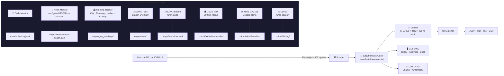

<p align="center">
  <h1 align="center">🌊 The Quadruplicate</h1>
  <p align="center">
    <strong>Scrape · Verify · Export · View · Chat · Stream · Monitor · Alert · Analyze · Query</strong><br/>
    A source-bound local intelligence platform for the
    <a href="https://crescentcity.org">City of Crescent City, CA</a> —
    powered by <a href="https://ecode360.com/CR4919">ecode360.com/CR4919</a>
  </p>
  <p align="center">
    <a href="https://github.com/docxology/crescent-city-intel"></a>
    <a href="#-quick-start"></a>
    <a href="docs/modules/llm.md"></a>
    <a href="LICENSE"></a>
    <a href="#-test-suite"></a>
    <a href="#-commands-reference"></a>
  </p>
</p>

**Explore the public edition at [quadruplicate.org](https://quadruplicate.org/).**
The static website exposes a bounded, source-attributed snapshot; the local Bun
application adds live collection, authenticated chat, indexing and operator tools.
Check each artifact's source clocks, geographic coverage and named gaps before
using it. Collection success, citation matching and hashes do not establish
legal interpretation, factual support or continuing upstream currency.

This is the editable project guide. GitHub displays
[`.github/README.md`](.github/README.md), generated from this file with repository
links adjusted for that location. After editing, run `bun run docs:generate`;
`bun run docs:check` and the release gate reject drift between the two guides.

For measured release evidence, use the
[versioned releases](https://github.com/docxology/crescent-city-intel/releases),
[local acceptance receipt](docs/release-acceptance.json) and
[current-state review](docs/project-review.md). Read their version, scope and
date: an older receipt does not certify a later tree. Remaining external and
human acceptance is tracked in [TODO.md](TODO.md).

---

## 📋 Table of Contents

- [🏙️ About Crescent City, CA](#-about-crescent-city-ca)
- [✨ What This Does](#-what-this-does)
- [🏗️ Architecture](#-architecture)
- [🚀 Quick Start](#-quick-start)
- [🎛️ Interactive Menu](#-interactive-menu-runsh)
- [🖥️ Web Viewer Features](#-web-viewer-features)
- [💬 LLM / RAG Chat](#-llm--rag-chat)
- [📡 Real-Time Monitoring & Alerts](#-real-time-monitoring--alerts)
- [📊 Analytics & Readability](#-analytics--readability)
- [🧭 Intelligence Domains](#-intelligence-domains)
- [📦 Export Formats](#-export-formats)
- [🌐 GitHub Pages Snapshot](#-github-pages-snapshot)
- [🔒 Integrity Checks and Evidence](#-integrity-checks-and-evidence)
- [📂 Project Structure](#-project-structure)
- [📚 Municipal Code Structure](#-municipal-code-structure)
- [🧪 Test Suite](#-test-suite)
- [⚡ Commands Reference](#-commands-reference)
- [🌐 API Reference](#-api-reference)
- [⚙️ Configuration](#-configuration)
- [📖 Documentation](#-documentation)
- [🚦 Current Status](#-current-status)
- [🧭 What To Do Next](#-what-to-do-next)
- [⚠️ Known Limitations](#-known-limitations)
- [LifeOS / Pulse integration](#lifeos--pulse-integration)

---

## 🏙️ About Crescent City, CA

The project anchors municipal-code and North Coast civic evidence on Crescent
City, California. Official City, County and Harbor source identities, geographic
coverage and collection limits are declared in the [source registry](src/source_registry.ts).
Use the linked primary notices for current schedules, regulations and safety
instructions; this software does not establish their legal or safety efficacy.

| Primary resource | Link |
| --- | --- |
| City of Crescent City | [crescentcity.org](https://crescentcity.org) |
| Municipal code | [ecode360.com/CR4919](https://ecode360.com/CR4919) |
| Del Norte County | [co.del-norte.ca.us](https://www.co.del-norte.ca.us/) |
| Crescent City Harbor District | [ccharbor.com](https://www.ccharbor.com/) |
| National Weather Service Eureka | [weather.gov/eka](https://www.weather.gov/eka/) |

---

## ✨ What This Does

| Stage | Description | Tests | Docs |
| :---- | :---------- | :---: | :--: |
| 🕷️ **Scrape** | Refreshes a validated live TOC, rejects partial/challenge pages, and atomically resumes only hash- and section-complete article artifacts | ✓ | [→](docs/modules/scraping.md) |
| ✅ **Verify** | SHA-256 integrity checks + TOC cross-reference + live re-fetch sampling | ✓ | [→](docs/modules/verification.md) |
| 📦 **Export** | JSON · Markdown · plain text · CSV index | ✓ | [→](docs/modules/export.md) |
| 🖥️ **View** | Web viewer: TOC, BM25 search, analytics dashboard, dark/light mode | ✓ | [→](docs/modules/gui.md) |
| 💬 **Chat** | Ollama or OpenRouter chat with Ollama embeddings + ChromaDB · citation checks (municipal code + YouTube transcripts) · opt-in content-free diagnostics | ✓ | [→](docs/modules/llm.md) |
| 📡 **Monitor** | Municipal code change detection + RSS/Atom news + government meeting tracking + YouTube meeting transcripts + Triplicate (Cloudflare), with per-source health | ✓ | [→](docs/modules/monitoring.md) |
| 📰 **Curate** | Source-grounded, bounded LLM summaries + domain tagging across news/meetings/YouTube with provider/model-aware retry-safe idempotency | ✓ | [→](docs/modules/monitoring.md) |
| 🚨 **Alert** | 20 monitors: 8 core hazard feeds + 12 extended civic and marine feeds | ✓ | [→](docs/modules/alerts.md) |
| 📊 **Analyze** | Deterministic PCA/K-Means, readability and coverage; unique activity/revision counts with explicit sampling denominators | ✓ | [→](docs/modules/gui.md) |
| 📅 **Calendar** | Occurrence/publication separation, bounded recurrence/cancellation and explicit timezone uncertainty | ✓ | [→](docs/modules/events.md) |
| 🔎 **Review** | Source-bound edition candidates and local directory field/correction evidence; unsupported legal dates remain null | ✓ | [→](docs/modules/source-review.md) |
| 🔐 **Contracts** | Shared versioned artifact/API validators and exact input/transform/output custody | ✓ | [→](docs/modules/artifact-contracts.md) |
| 🌐 **Publish** | Bounded static snapshot for GitHub Pages with source health and provenance | ✓ | [→](docs/modules/pages.md) |
| 📝 **Manuscript** | Evidence-bound IMRAD paper with formal contracts, claim ledger, and template-rendered PDF/HTML | ✓ | [→](docs/manuscript.md) |

---

## 🏗️ Architecture


```mermaid
flowchart LR
    A["🌐 ecode360.com/CR4919"] -->|Playwright + CF bypass| B["🕷️ Scraper"]
    B --> C["📄 output/articles/*.json\n(manifest-driven counts)"]
    C --> D["✅ Verifier\nSHA-256 + TOC + live re-fetch"]
    D --> E["📦 Exporter"]
    E --> F["JSON · MD · TXT · CSV"]
    C --> G["🖥️ GUI :3000\nBM25 · Analytics · Chat"]
    C --> H["💬 LLM / RAG\nOllama + ChromaDB"]

    subgraph Intelligence["⚡ Real-Time Intelligence Layer"]
        J["📡 Code Monitor"] --> K["monitor-history.jsonl"]
        L["📰 News Monitor\nconfigured RSS/Atom sources"] --> M["output/news/source-health.json"]
        N["🏛️ Meeting Tracker\nCity · Planning · Harbor · County"] --> O["output/gov_meetings/"]
        P["🌊 NOAA Tides\nStation 9419750"] --> Q["output/tides/"]
        R["🌊 NOAA Tsunami\nCAP alerts"] --> S["output/alerts/tsunami/"]
        T["🌍 USGS M4+\n200 km radius"] --> U["output/alerts/earthquake/"]
        V["⛈️ NWS CAZ101\nCoastal alerts"] --> W["output/alerts/weather/"]
        X["🦀 CDFW\nCrab season"] --> Y["output/fishing/"]
    end

    style Intelligence fill:#1a1a2e,stroke:#4a90d9
```

> 📐 **Full architecture**: [docs/architecture.md](docs/architecture.md) — data flow diagram, module dependency graph, directory structure

---

## 🚀 Quick Start

### Prerequisites

| Tool | Version | Install |
| :--- | :------ | :------ |
| [Bun](https://bun.sh) | 1.4.2 (CI pin) | `curl -fsSL https://bun.sh/install \| bash` |
| [Playwright](https://playwright.dev) | locked package + Chromium | `bunx playwright install chromium` after `bun install` |
| [Ollama](https://ollama.ai) | any | [ollama.ai/download](https://ollama.ai/download) — embeddings and default local chat; still required for retrieval when OpenRouter handles chat |
| [ChromaDB](https://trychroma.com) | Compose pin 1.5.9 | Optional `llm` Compose profile, published locally on port 8001 — for RAG chat only |

### Install & Run

```bash
# 1. Clone and install
git clone https://github.com/docxology/crescent-city-intel.git
cd crescent-city-intel
bun install --frozen-lockfile
bunx playwright install chromium
bun run source-discovery # Generate canonical registry inventory; offline by default

# 2. Run the full pipeline: scrape → verify → export
bun run all

# 3. Launch the web viewer
bun run gui          # → http://localhost:3000

# 4. Run all tests (authoritative release gate)
bun run validate
```

> 📖 **Detailed setup**: [docs/setup.md](docs/setup.md) — step-by-step from prerequisites through RAG chat

---

## 🎛️ Interactive Menu (`run.sh`)

The top-level `run.sh` delegates to the Bun launcher in `src/interactive_menu.ts`.
It shows a menu or runs a declared `package.json` command with the supplied arguments:

```bash
./run.sh          # Interactive menu
./run.sh gui      # Launch web viewer directly
./run.sh test     # Run test suite directly
./run.sh setup    # Install dependencies and generate registry evidence
./run.sh status   # LLM/vector-stack status
./run.sh test:browser # Browser/API smoke against the running GUI
bunx playwright install chromium # Install the browser separately
```

The menu includes:

| Section | Options |
| :------ | :------ |
| **Setup & Data Pipeline** | Install deps · Run tests · Scrape · Verify · Export |
| **Web Interface** | Launch GUI · Real browser/API smoke |
| **AI / RAG** | Index ChromaDB · Interactive chat; query and status are available as direct package commands |
| **Monitoring & Alerts** | Code monitor · News (configured RSS/Atom feeds) · Gov meetings · Tides · Fishing · Tsunami · Earthquake · Weather · All alerts · Weekly check |
| **Analytics & Publication** | Readability · Domain coverage · Reports · Analytics · Pages · Manuscript |
| **Full Pipeline** | `all` delegates scrape → verify → export; setup, checks and GUI have separate commands |

The real browser/API smoke command checks the running GUI. This is an expected
response example, not a recorded live acceptance:

```
  /api/health                    HTTP 200  server/provider/source health
  /api/domains                   HTTP 200  array len=12
  /api/search?q=tsunami&limit=3  HTTP 200  keys:query,total,offset,limit,count
  /api/domains/coverage          HTTP 200  keys:computedAt,totalSections,...
  /api/readability               HTTP 200  keys:computedAt,totalSections,...
  /api/monitor/alerts            HTTP 200  keys:fetchedAt,alerts
```

---

## 🖥️ Web Viewer Features

Launch with `bun run gui` → open **<http://localhost:3000>**:

| Feature | Description |
| :------ | :---------- |
| 📋 **TOC Tree** | Collapsible table of contents with manifest-driven titles, articles, and sections |
| 📖 **Section Viewer** | Formatted legal text with legislative history and cross-references |
| 🔍 **BM25 Search** | Full-text search with Porter stemming, title-scoped filters, `<mark>` highlight, pagination |
| 🌗 **Dark / Light Mode** | Toggle between themes, persisted in `localStorage` |
| ✨ **AI Summaries** | Per-section legal summaries generated on-demand via the configured chat provider |
| 💬 **RAG Chat** | Natural-language questions answered with cited code sections (GET & POST) |
| 📊 **Analytics Dashboard** | Bar charts (sections/words per Title) · PCA scatter plot · K-Means · word loadings |
| 📈 **Readability** | Flesch-Kincaid grade level for every section; hardest/easiest ranking |
| 🧭 **Domains Panel** | 12 intelligence domains — each cross-referenced to specific code sections |
| 📡 **Monitor Status** | Live view of latest change-detection report + alert aggregation |
| 🌊 **Tides & Alerts** | Current NOAA CO-OPS tide predictions and hazard alert status |

> 🔧 **GUI internals**: [docs/modules/gui.md](docs/modules/gui.md) — all API routes, search engine, analytics pipeline

---

## 💬 LLM / RAG Chat

Run services in their own terminals. For the API example, restart an existing
GUI process with the same privately supplied key used by the client. The
browser GUI receives its boot key through the trusted local page; external
clients must supply `X-API-Key` explicitly.

```bash
# Start prerequisites in separate terminals
ollama serve &
docker run --rm --name cci-chroma -p 127.0.0.1:8001:8000 \
  -v cci-chroma:/data chromadb/chroma:1.5.9

# Pull required models
ollama pull nomic-embed-text    # embeddings
ollama pull gemma3:4b           # chat / summarization

# Verify services and installed models before indexing
bun run scripts/stack-readiness.ts

# Index every section in the current scrape into ChromaDB
bun run index

# Interactive chat session
bun run chat

# Single CLI query
bun run query "What are the tsunami evacuation requirements?"
bun run query "What are the zoning setback requirements for residential areas?"
bun run query "What permits are required to operate a commercial fishing vessel from the harbor?"

# For API use, start the GUI with a privately generated stable key in this shell.
# Replace this placeholder privately; share the same environment with curl.
export CRESCENT_CITY_API_KEY='<your privately generated key>'
bun run gui &

# POST API (for long questions; GET also requires X-API-Key)
curl -X POST http://localhost:3000/api/chat \
  -H "X-API-Key: $CRESCENT_CITY_API_KEY" \
  -H "Content-Type: application/json" \
  -d '{"q": "Summarize all sections in Title 17 related to coastal zone management"}'
```

The RAG pipeline:
1. Embeds questions via the configured embedding model (default `nomic-embed-text`).
2. Retrieves similar chunks from the activated ChromaDB collection.
3. Generates an answer through the selected chat provider with section references.
4. Checks cited section identities and returns retrieval/model lineage with
   `grounded: false`: generated output stays `generated-unverified`, or the
   response abstains when required citations are missing or invalid. Citation
   presence does not establish semantic support or legal currency.

Questions, answers, and conversation history are not persisted. Optional
`CC_QUERY_LOGGING=metadata` records bounded content-free diagnostics under
`output/private/`; public exports exclude those records.

> 🔧 **LLM internals**: [docs/modules/llm.md](docs/modules/llm.md) — config, chunking strategy, embedding pipeline

---

## 📡 Real-Time Monitoring & Alerts

### Municipal Code Change Monitor

Detects upstream changes on ecode360.com by comparing SHA-256 hashes and section counts against the last known good scrape.

```bash
bun run monitor         # check for changes → output/monitor-history.jsonl
```

### News Monitor (configured RSS/Atom sources)

Aggregates local NorCal news feeds, filtering for Crescent City-relevant content. Uses persistent deduplication across runs via `output/state/news-seen-ids.json` and writes per-source health diagnostics.

```bash
bun run news                            # all keywords
bun run news -- --keywords="tsunami,earthquake,harbor"  # targeted keywords
```

### Source discovery and coverage boundary

`src/source_registry.ts` is the authoritative inventory for Crescent City and
Del Norte County online information. It records canonical URLs, authority,
region, provenance, collection mode, and whether a source is `monitored`,
`discovery-only`, or `reference-only`. Discovery-only entries are intentionally
visible gaps rather than false-success monitors.

```bash
bun run source-discovery             # deterministic inventory + known health joins
bun run source-discovery -- --check  # bounded live GET probes; outages are recorded
```

The idempotent artifacts are `output/source-registry.json`,
`output/source-discovery.json`, and `output/state/source-discovery-seen.json`.
Their fingerprint and coverage gaps are included in the local GUI Source Coverage
workspace, `/api/sources`, `/api/source-discovery`, monthly reports, and GitHub
Pages exports. The GUI and Pages dashboard can inspect individual records and
download filtered JSON/CSV envelopes without losing status or provenance.

The local GUI and public Pages landing views are welcome linktrees: visitors
can choose local news and source-grounded summaries, source freshness, the
municipal code, safety alerts, analytics, civic reports, structured downloads,
or official local source hubs before entering the deeper tools.

**Configured sources**: Lost Coast Outpost · Del Norte Triplicate (reference-only RSS metadata) · Humboldt County official news · KIEM-TV/NBC 3 via Redwood News RSS/HTML fallbacks · Redwood Voice · North Coast Journal. Per-source health records the actual result of each collection; a configured URL does not establish availability. The feed set is local- and civic-specific.

**Filter keywords** include crescent city · del norte · tsunami · harbor · fishing · crabbing · pelican bay · evacuation · fire. The [news monitor](src/news_monitor.ts) owns the full matching list.

### Government Meeting Tracker

Collects City Council and Planning listings, Harbor archives, and the County's
public CivicClerk meeting/document catalog. Provider collection windows and
unavailable archive/media sources remain explicit; a listing does not prove
that a meeting occurred or that its documents are complete.

```bash
bun run gov-meetings    # → output/gov_meetings/
```

**Tracked**: City Council · Planning Commission · Harbor Commission · Del Norte
County Board of Supervisors. County agenda, packet and minutes links retain
their exact published-file identities. The provider's civil day is preserved;
its timestamp suffix is insufficient evidence for a local meeting time.

### 🌊 NOAA CO-OPS Tides (Station 9419750)

NOAA tide predictions and observed water levels for the Crescent City station.

```bash
bun run alerts:tides    # 48h predictions · current water level · 7 ft MLLW alert
```

Station 9419750 coordinates: **41.745°N, 124.184°W** — [NOAA Tides Online](https://tidesandcurrents.noaa.gov/stationhome.html?id=9419750)

### 🦀 CDFW Dungeness Crab Season Monitor

Combines an estimated California Dungeness crab season calendar with CDFW
North Coast notices for domoic acid or entanglement delays.

```bash
bun run alerts:fishing  # → output/fishing/fishing-<timestamp>.json
```

Calendar status is a heuristic estimate, not verification of current regulations
or permission to fish. Consult [current CDFW Dungeness crab notices](https://wildlife.ca.gov/Fishing/Ocean/Regulations/Crab)
for the applicable area, fishery, dates and emergency restrictions.

### Hazard Alert Monitors

```bash
bun run alerts:tsunami      # NOAA CAP → California tsunami warnings, watches and advisories
bun run alerts:earthquake   # USGS GeoJSON → M4.0+ within 200 km of Crescent City
bun run alerts:weather      # NWS → Del Norte coastal zone CAZ101 advisories
bun run alerts              # all concurrently
bun run weekly-check        # full health-check + summary report
bun run cron-setup -- --dry-run # print the escaped scheduler plan; installs nothing
```

| Alert Type | Source | Threshold |
| :--------- | :----- | :-------- |
| Tsunami | NOAA `api.weather.gov/alerts` | California tsunami warnings, watches and advisories |
| Earthquake | USGS `earthquake.usgs.gov` Feed | M4.0+ within 200 km, Cascadia Subduction Zone priority |
| Weather | NWS Eureka office, zone CAZ101 | Coastal flood advisory · high wind · storm surge |
| Tides | NOAA CO-OPS Station 9419750 | ≥7.0 ft MLLW current water level (storm surge / king tide) |

> 🔧 **Monitor internals**: [docs/modules/monitoring.md](docs/modules/monitoring.md) · [docs/modules/alerts.md](docs/modules/alerts.md)

---

## 📊 Analytics & Readability

### Flesch-Kincaid Readability Scoring

Every section of the municipal code is scored for reading difficulty. Crescent City's code includes both plain-language notices and dense legal text.

```bash
bun run readability        # score all sections → output/readability.json
                           # also available at GET /api/readability
```

| Difficulty | Grade Level | Examples in Crescent City Code |
| :--------- | :---------- | :----------------------------- |
| **Plain** | < 8 | Short animal control definitions, simple fee schedules |
| **Standard** | 8–12 | Traffic regulations, permit application requirements |
| **Complex** | 12–16 | Zoning conditional use permits, building code sections |
| **Legal** | > 16 | Environmental impact language, subdivision regulations |

### Domain Coverage Metrics

Compute what percentage of the current manifest's sections is cross-referenced by each of the 12 intelligence domains.

```bash
bun run coverage           # → output/domain-coverage.json
                           # also available at GET /api/domains/coverage
```

---

## 🧭 Intelligence Domains

The project maps the municipal code to **12 civic intelligence domains**, each cross-referenced to specific sections with external resource links:

| Domain | Icon | Key Topics | Key Code Titles |
| :----- | :--- | :--------- | :-------------- |
| Emergency Management | 🌊 | Tsunami evacuation · Cascadia earthquake · EOC · mutual aid | 8, 9, 12 |
| Business & Economic Dev | 🦀 | Harbor permits · fishing licenses · tourism · crab season | 3, 5, 13 |
| Public Safety & Justice | 🚔 | Police · corrections · Pelican Bay · crime prevention | 9, 10 |
| Public Health & Safety | 🏥 | EMS · food safety · mental health/CARE Court | 6, 8, 9 |
| Environment & Conservation | 🌲 | Coastal zone management · redwoods · wildlife · waste | 8, 13, 17 |
| Infrastructure & Services | 🏗️ | Utilities · roads · parks · building permits · zoning | 12, 13, 15, 16, 17 |
| Housing & Homelessness | 🏠 | Affordable housing · emergency shelter · vehicle dwelling · CARE Court | 8, 13, 15, 16, 17 |
| Harbor & Marine Operations | ⚓ | Harbor commerce · dredging · fishing fleet · waterfront | 3, 5, 13 |
| Event Planning & Tourism | 🎪 | Special events · film permits · tourism promotion | 5, 9 |
| Education & Youth | 📚 | School district · youth programs · library | 2, 9 |
| Climate & Environment | 🌡️ | Sea-level rise · drought/water conservation · air quality | 8, 17 |
| Demographics & Social Indicators | 📊 | Population profile · poverty · homelessness trends | 6, 8, 9 |

**External cross-references per domain:**

- 🌊 Emergency: [CalOES Tsunami](https://www.caloes.ca.gov/hazard-mitigation/tsunami/) · [NOAA PTWC](https://www.tsunami.gov) · [Del Norte OES](https://www.co.del-norte.ca.us/)
- 🦀 Business: [Crescent City Harbor](https://crescentcityharbor.com) · [CDFW North Coast](https://wildlife.ca.gov/regions/1)
- 🌲 Environment: [Redwood NPS](https://www.nps.gov/redw/) · [California Coastal Commission](https://www.coastal.ca.gov/)
- 🏠 Housing: [CalHFA](https://www.calhfa.ca.gov/) · [HUD California](https://www.hud.gov/states/california) · [CARE Court](https://carecourt.ca.gov/)

### Tiles-free civic and hazard geo view

`buildGeoIntel()` emits the transferable municipality contract (anchor plus
civic domains), and `buildGeoView()` derives its
`crescent-city-geo-view/v1` feature view: Del Norte bounds, the Crescent City
anchor, nominal hazard-domain points, and hazard-weighted code sections. The
GUI **Hazard Geo** subtab and public Pages snapshot render that same view
without a tiles provider; GEO-INFER consumes the contract directly instead of
re-scraping this platform.

---

## 📦 Export Formats

| Format | Output | Description |
| :----- | :----- | :---------- |
| **JSON** | `output/crescent-city-code.json` | All sections in the current manifest with metadata, GUIDs, and hashes |
| **Markdown** | `output/markdown/` | Organized by Title/Chapter with cross-links |
| **Text** | `output/crescent-city-code.txt` | Plain text corpus for NLP/LLM training |
| **CSV** | `output/section-index.csv` | Section index with GUIDs for cross-referencing |
| **Readability** | `output/readability.json` | Flesch-Kincaid scores for all sections in the current manifest |
| **Coverage** | `output/domain-coverage.json` | Domain cross-reference coverage % |
| **Geo-Intel** | `pages-data/geo-intel.json` + `output/geo-intel.json` | Transferable machine-readable municipality contract (Crescent City default civic + hazard) for geospatial consumers (GEO-INFER) |
| **Geo-Observations** | `pages-data/geo-observations.json` + `output/geo-observations.json` | `crescent-city-geo-observations/v1` live hazard-observation envelope (composite severity, per-monitor states, hazard summary, contract freshness) for GEO-INFER consumers |
| **Private diagnostics (opt-in)** | `output/private/request-receipts.jsonl` | Bounded allowlisted request metadata; no questions, answers, or history; excluded from Pages |
| **Pipeline run** | `output/state/latest-pipeline-run.json` | Stage-level status, duration, output paths, and source-health summary — produced by `bun run weekly-check`, so it is absent until the first weekly run |
| **Curation run** | `output/state/curation-report.json` | Provider/model, success counts, fingerprints, and retryable failures |
| **Report metadata** | `output/reports/monthly-YYYY-MM.json` | Period bounds, numeric metrics, warnings, and health |

> 🔧 **Export details**: [docs/modules/export.md](docs/modules/export.md)

---

## 🌐 GitHub Pages Snapshot

The repository publishes a static snapshot from `.github/workflows/pages.yml`.
Configured public target: <https://quadruplicate.org/>.
The workflow runs the deterministic release gate, collects the live monitors,
and exports `.pages/` with provenance-aware source health. Source state is
exported separately from pipeline state: `ok` and `empty` are present checks,
while `unavailable` and `stale` are named coverage gaps. A source gap does
not make an otherwise complete snapshot `degraded`, and it is never rendered
as an unexplained calm state.

The public artifact includes the municipal-code export when present, an
API-shaped `data/geo-intel.json` contract with its tiles-free geo view, a
schema-checked local-establishments directory (`data/directory.json`, rendered on
[directory.html](https://quadruplicate.org/directory.html)
with pull-down menus over government, schools, healthcare, restaurants,
churches, retail, services, finance, media, lodging, and attractions), source
health, recent news and meeting items, alert snapshots, source-grounded
curation, and the latest civic report. It excludes API keys, chat/request/
search/RAG logs, Chroma data, and Triplicate article content. Triplicate
metadata is reference/citation-only and is not an input to curation, embeddings,
or training.

The static dashboard remains interactive without a backend: filter source
health by state, filter public items by text, search the exported code locally,
refresh the immutable snapshot, and inspect pipeline/provider/report metadata.

```bash
bun run pages:export -- --source output --seed pages-data --output .pages
bun run pages:validate -- .pages
```

`pages-data/` is the reviewed public seed for the municipal-code snapshot and
the provenance-bearing directory (`directory.json`). Source citations do not
establish present field currency: nullable consultation/review times and the
local correction ledger distinguish recorded evidence from completed editorial
review. Unknown fields remain null.
Refresh the code seed after a verified scrape with `bun run pages:seed`.

See [the Pages module guide](docs/modules/pages.md) for deployment triggers,
artifact boundaries, and local preview instructions.

---

## 🔒 Integrity Checks and Evidence

- 🔐 Every article page **SHA-256 hashed** at scrape time (async, WebCrypto API)
- 🔄 Verification **re-computes hashes** from saved files and compares against manifest
- 📋 Section presence **cross-referenced** against the saved TOC
- 🌐 Publication requires passing **local replay, current live TOC, and a nonempty live sample**; errors, mismatches, or unattempted required checks deny eligibility. Sampling checks the selected pages, not every live page.
- ⏱️ Manifest records **exact timestamps** for audit trail
- 💾 **Resume support** — interrupt and restart safely; only exact current-TOC artifacts are skipped
- 🧱 **Recoverable artifacts** — owned writer leases, bounded retained-state reads and exact-byte multi-artifact transactions preserve prior complete outputs on failure
- 📎 **Derived custody** — actual input, transformer/configuration and output hashes support private replay, separate from municipal eligibility and semantic/legal review
- 🕒 **Primary clocks** — declared observation/product freshness cannot be refreshed by an HTTP probe or a new build time
- 📚 **Shared authority** — supported family schemas are reused by loaders, API and Pages; generated configuration/export/HTTP inventories fail filename-specific drift checks
- 🧭 **TOC provenance** — manifest records a TOC fingerprint plus live/cached source

> 🔧 **Verification details**: [docs/modules/verification.md](docs/modules/verification.md)

---

## 📂 Project Structure

An orientation map, not an inventory. The exhaustive tree — every module under
`src/`, gated so it cannot drift — lives in
[AGENTS.md](AGENTS.md#directory-map).

```text
  src/
  types.ts              # All TypeScript interfaces (TocNode, FlatSection, ScrapeManifest…)
  constants.ts          # URLs, paths, rate limits (env-overridable)
  utils.ts              # Hash, flatten, chunk, truncate, sleep, retry, htmlToText…
  logger.ts             # Structured logger (LOG_LEVEL env variable)
  browser.ts            # Playwright lifecycle + Cloudflare bypass
  toc.ts                # TOC fetcher + tree utilities
  content.ts            # Page scraper + section extraction
  scrape.ts             # Scraper orchestrator with resume
  scraper_utils.ts      # TOC/artifact validation and retry utilities
  verify.ts             # Verification engine
  export.ts             # Multi-format exporter (JSON, MD, TXT, CSV)
  domains.ts            # 12 civic intelligence domains with code cross-refs
  monitor.ts            # Municipal code change detection
  news_monitor.ts       # RSS/Atom news aggregator (configured sources + health + persistent dedup)
  gov_meeting_monitor.ts # City/Planning listings, Harbor archives and County documents
  official_meetings.ts   # Bounded official archive and County CivicClerk acquisition
  meeting_documents.ts  # Exact PDF bytes and native page-addressable extraction
  youtube_monitor.ts    # YouTube listing + auto-caption transcript pipeline (yt-dlp)
  triplicate_monitor.ts # Reference/citation-only Del Norte Triplicate monitor (Playwright)
  curation.ts           # LLM provider-aware, source-grounded curation with domain tagging
  source_registry.ts    # Canonical online source inventory + bounded discovery probes
  doc_inventory.ts      # Source/HTTP inventories and complete GitHub README projection
  monthly_report.ts     # Monthly civic health report generator
  analytics_backend.ts  # Cross-surface analytics envelope (GUI, pipeline, Pages)
  alert_analytics.ts    # Unified alert timeline across all 20 monitors + per-type statistics
  structured_queries.ts # Legislative history, section compare, semantic similarity
  section_graph.ts      # Section dependency graph (citation network)
  section_longevity.ts  # Section age, dormancy, churn
  word_frequency.ts     # Corpus term frequency + tf-idf salience
  ordinance_chronology.ts # Ordinance lineage and per-section amendment trails
  insights.ts           # Cross-artifact civic trend brief
  lifeos_bridge.ts      # LifeOS/Pulse LocalIntelligence digest builder (Pulse LOCAL tab)
  legal_parser.ts       # Citation extractor, glossary builder, ordinance parser
  manuscript_variables.ts # Durable manuscript variable extraction from analytics
  alerts/
    severity.ts         # Composite alert severity over all 20 monitor inputs
    noaa_tsunami.ts     # NOAA CAP tsunami warning monitor
    noaa_tides.ts       # NOAA CO-OPS tides (station 9419750, 48h predictions)
    usgs_earthquake.ts  # USGS earthquake monitor (M4.0+, 200 km, Cascadia)
    nws_weather.ts      # NWS Del Norte coastal zone CAZ101 alerts
    cdfw_fishing.ts     # CDFW Dungeness crab season calendar + bulletin monitor
    epa_airnow.ts       # EPA AirNow air quality monitor (PM2.5, ozone, PM10 AQI)
    calfire_wildfire.ts # CAL FIRE wildfire incident monitor
    ndbc_marine.ts      # NDBC marine buoy monitor (wave, wind, water temp)
  api/
    middleware.ts       # Sliding-window rate limiter · API key auth · request log
  domains/
    coverage.ts         # Domain coverage % with prefix matching across the current manifest
  shared/
    paths.ts            # Centralized output path constants
    data.ts             # Data loading layer (60s TTL cache, parallel, actionable errors)
    porter_stem.ts      # Zero-dep Porter stemmer (Steps 1a-5b) for BM25 indexing
    readability.ts      # Flesch-Kincaid Grade Level + Reading Ease + Gunning Fog
    fuzzy.ts            # Levenshtein fuzzy matching + typo correction
    idempotency.ts      # Shared (id, contentHash)-keyed idempotency store for all monitors
    orchestration.ts    # Durable step/run envelopes, build metadata, and run IDs
    source_health.ts    # Typed source-health contract, atomic artifact writes, freshness
  gui/
    server.ts           # Bun.serve() HTTP server (port 3000)
    routes.ts           # All /api/* route handlers (see openapi.yaml)
    search.ts           # In-memory BM25 full-text search (stemmed, paginated, fuzzy fallback)
    analytics.ts        # PCA, K-Means, word loadings analytics
    static/index.html   # Single-page app (no framework, no build step)
  llm/
    config.ts           # LLM configuration (models, chunk sizes, topK, rate spacing)
    provider.ts         # Ollama/OpenRouter chat-provider selection + health check
    ollama.ts           # Ollama API wrapper (embed, chat, health check)
    openrouter.ts       # OpenRouter API wrapper with model validation
    chroma.ts           # ChromaDB client (collections, add, query)
    embeddings.ts       # Chunk → embed → index pipeline (fingerprinted, stale-chunk deletion)
    rag.ts              # RAG pipeline with retrieval lineage and citation-identity checks
    streaming_rag.ts    # SSE streaming RAG (provider-native Server-Sent Events)
    index.ts            # CLI entry point (index, chat, query, status, preflight)
  pages_snapshot.ts     # Bounded public GitHub Pages static snapshot exporter
  pages_validation.ts   # Generated Pages artifact validator (release-gate checks)
  pages_bundle_validation.ts # Owned, bounded evaluation of shipped Pages helper behavior
  pages_seed.ts         # Verified municipal-code seed refresh
  browser_smoke.ts      # Real-browser GUI smoke flow (driven by scripts/browser-smoke.ts)
  release_gate.ts       # Deterministic release-gate checks (driven by scripts/validate.ts)
  pages/static/         # Static dashboard and 404 fallback for Pages
scripts/
  weekly-check.ts       # Weekly health check orchestrator (all monitors + composite)
  run-alerts.ts         # Alert monitor runner (20 monitors, all feeding the composite)
  run-monitor.ts        # Change detection runner
  run-news.ts           # News monitor runner (--keywords= CLI flag)
  run-meetings.ts       # Meeting monitor runner
  run-youtube.ts        # YouTube listing/transcript pipeline runner
  run-curation.ts       # Provider-aware grounded curation runner
  run-analytics.ts      # Analytics overview runner
  run-coverage.ts       # Domain coverage analysis orchestrator
  run-readability.ts    # Readability scoring orchestrator
  run-insights.ts       # Civic insight brief runner (also served at /api/insights)
  run-source-discovery.ts # Source registry + bounded probe runner
  export-pages.ts       # Build the bounded .pages public snapshot
  refresh-pages-data.ts # Refresh the verified tracked municipal-code seed
  validate-pages.ts     # Validate the generated Pages artifact
  validate.ts           # Authoritative deterministic release gate
  validate-manuscript.ts # Manuscript source contract + evidence checks
  hydrate-manuscript.ts # Write evidence-bound manuscript into output/manuscript/
  repair-output.ts      # Historical output repair/quarantine utility
  z_generate_manuscript_variables.py # Python manuscript-variable generation for template render
  cron-setup.sh         # dry-run launchd/cron plan wrapper
tests/                  # deterministic zero-mock suite; run `bun run validate` for the current count
docs/                   # Full module documentation suite
docs/manuscript/             # Evidence-bound IMRAD paper with formal contracts and claim ledger
pages-data/             # Reviewed public seed artifacts for static Pages
output/                 # Scraped data + reports (gitignored)
.pages/                 # Generated static GitHub Pages snapshot (gitignored)
openapi.yaml            # OpenAPI 3.0.3 spec (v3.2.0)
```

---

## 📚 Municipal Code Structure

The selected municipal edition carries its exact title, article and section
inventory in [the reviewed manifest](pages-data/manifest.json) and
[table of contents](pages-data/toc.json). A later live scrape can select a
different complete edition; use its manifest for counts.

<details>
<summary><strong>📜 Reviewed title labels and primary code links</strong></summary>

| Title | Source title |
| :---- | :----------- |
| 1 | [General Provisions](https://ecode360.com/44236159) |
| 2 | [Administration and Personnel](https://ecode360.com/44236315) |
| 3 | [Revenue and Finance](https://ecode360.com/44236510) |
| 4 | [(Reserved)](https://ecode360.com/44236695) |
| 5 | [Business Taxes, Licenses and Regulations](https://ecode360.com/44236697) |
| 6 | [Animal Control](https://ecode360.com/44237408) |
| 7 | [(Reserved)](https://ecode360.com/44237457) |
| 8 | [Health and Safety](https://ecode360.com/44237458) |
| 9 | [Public Peace, Morals and Welfare](https://ecode360.com/44238234) |
| 10 | [Vehicles and Traffic](https://ecode360.com/44238484) |
| 11 | [(Reserved)](https://ecode360.com/44238862) |
| 12 | [Streets, Sidewalks and Public Places](https://ecode360.com/44238863) |
| 13 | [Public Services](https://ecode360.com/44239326) |
| 14 | [Procurement Procedures](https://ecode360.com/44240147) |
| 15 | [Buildings and Construction](https://ecode360.com/44240405) |
| 16 | [Subdivisions](https://ecode360.com/44240783) |
| 17 | [Zoning](https://ecode360.com/44241015) |

The reviewed TOC also contains Employer-Employee Relations Rules, the Sewer
Manual, Statutory References and Tables. Nested divisions and chapter/article
labels vary; this guide does not substitute hand-maintained chapter counts or
inferred subject examples for the source tree.

</details>

---

## 🧪 Test Suite

```
Run `bun run validate` for the current pass/fail result. The suite uses real
functions and local HTTP fixtures; external live smoke checks are separate.
```

The test matrix is intentionally generated by the test runner rather than
duplicated here. This prevents documentation from claiming stale per-file
counts as modules evolve. Run `bun test` for the authoritative total and
`bun run validate` for the complete release gate.

Run tests:

```bash
bun test              # deterministic suite
bun run test:typecheck # separate strict tests/source typecheck
bun run validate      # strict source/test types + fenced suites + actual-line coverage + contracts
bun test tests/search.test.ts   # single file
```

---

## ⚡ Commands Reference

### Core Pipeline

| Command | Description |
| :------ | :---------- |
| `bun install --frozen-lockfile` | Install locked dependencies |
| `bun run scrape` | Scrape municipal code (resumable, Cloudflare bypass). `--full-rescrape` re-fetches every article, bypassing the resume cache |
| `bun run verify` | Verify SHA-256 integrity + TOC cross-reference |
| `bun run export` | Export to JSON, Markdown, TXT, CSV |
| `bun run all` | Scrape → Verify → Export (full pipeline) |
| `bun run gui` | Web viewer → http://localhost:3000 |

### AI / RAG

| Command | Description |
| :------ | :---------- |
| `bun run index` | Index every section in the current scrape into ChromaDB |
| `bun run chat` | Interactive RAG chat (configured provider; Ollama by default) |
| `bun run query "..."` | Single RAG query |
| `bun run status` | Check Ollama / ChromaDB / index status |

### Monitoring & Alerts

| Command | Description |
| :------ | :---------- |
| `bun run monitor` | Detect municipal code changes |
| `bun run news` | Fetch local news RSS (--keywords= flag supported) |
| `bun run source-discovery` | Inventory canonical sources; add `-- --check` for bounded probes |
| `bun run gov-meetings` | Scrape city meeting agendas/minutes |
| `bun run alerts` | Run all alert monitors concurrently |
| `bun run alerts:tsunami` | Poll NOAA CAP tsunami warnings |
| `bun run alerts:earthquake` | Poll USGS earthquake feed (M4.0+, 200 km) |
| `bun run alerts:weather` | Poll NWS coastal weather alerts (CAZ101) |
| `bun run alerts:tides` | NOAA CO-OPS tides (station 9419750, 48h) |
| `bun run alerts:fishing` | CDFW crab season + marine bulletins |
| `bun run weekly-check` | Full weekly health check + summary report |
| `bun run cron-setup -- --dry-run` | Print the host scheduler plan; review before manual installation |
| `bun run pages:export` | Build a bounded static snapshot from `output/` |
| `bun run geo:intel` | Build the machine-readable municipality contract (Crescent City default civic + hazard; `pages-data/geo-intel.json` + `output/geo-intel.json`) |
| `bun run pages:seed` | Refresh the tracked verified municipal-code seed |
| `bun run pages:validate` | Validate snapshot schema, health truthfulness, and public boundaries |

### Analysis

| Command | Description |
| :------ | :---------- |
| `bun run readability` | Flesch-Kincaid scoring → `output/readability.json` |
| `bun run coverage` | Domain coverage % → `output/domain-coverage.json` |
| `bun run analytics` | Shared deterministic overview → `output/state/analytics-overview.json` with optional LLM executive summary |
| `bun run insights` | Cross-artifact civic trend brief → `output/state/civic-insights.json` (also `GET /api/insights`) |
| `bun run manuscript:check` | Validate IMRAD structure, citations, labels, claim ledger, and source tokens |
| `bun run manuscript:hydrate` | Resolve manuscript tokens from the canonical analytics overview |
| `bun run source:coverage` | Read-only retained source/geography/access assessment; no network or output writes |
| `bun run meeting-documents` | Bounded primary PDF capture with optional native `pdftotext` page spans |
| `bun run docs:check` | Check configuration/export/HTTP inventories, the complete GitHub README projection and current command drift |
| `bun run docs:generate` | Regenerate inventories and GitHub README after deliberate source or root-guide edits |
| `bun run test:gui-readers` | Real primary-API desktop/mobile reader journeys in isolated roots |
| `bun run test:gui-journeys` | Real browser storage/rendering/request-security journeys |
| `bun test` | Run the deterministic test suite |
| `bun run test:coverage` | Run the deterministic suite with coverage |
| `bun run test:browser` | Headless-Chromium smoke test of the running GUI (requires Playwright browser) |

---

## 🌐 API Reference

The GUI server (`bun run gui`) exposes a REST API at `http://localhost:3000`:

| Endpoint | Method | Description |
| :------- | :----- | :---------- |
| `/api/toc` | GET | Full TOC tree |
| `/api/article/:guid` | GET | Article with all sections |
| `/api/section/:guid` | GET | Single section |
| `/api/search?q=...&title=8&type=section&highlight=true&offset=0&limit=50` | GET | BM25 search (paginated, stemmed, filtered) |
| `/api/sections?title=8&chapter=04` | GET | Hierarchical section listing |
| `/api/chat?q=...` | GET | RAG query (short questions) |
| `/api/chat` | POST | RAG query (`{q}` JSON body, long questions) |
| `/api/summarize` | POST | Configured-provider section summarizer |
| `/api/stats` | GET | Scrape statistics |
| `/api/domains` | GET | All 12 intelligence domains |
| `/api/domain/:id` | GET | Domain detail with topic cross-refs |
| `/api/domain/:id/sections` | GET | Domain → code section map |
| `/api/domains/coverage` | GET | Domain coverage % report |
| `/api/domains/search?q=...` | GET | Search across domains |
| `/api/readability` | GET | Flesch-Kincaid scores (all sections) |
| `/api/sections/graph?title=&guid=&depth=` | GET | Section dependency graph — degree, density, components, hubs, authorities, dangling citations; `guid` returns an ego network |
| `/api/sections/longevity?title=&asOfYear=` | GET | Section age, dormancy, churn, and a contiguous decade histogram |
| `/api/lexicon/frequency?title=&minLength=&minDf=` | GET | Corpus term frequency and tf-idf salience |
| `/api/ordinance/chronology?guid=` | GET | Ordinance lineage and per-section amendment trails |
| `/api/insights?rebuild=1&window=` | GET | Cross-artifact civic trend brief |
| `/api/llm/models` | GET | Models the configured chat provider can serve |
| `/api/analytics/overview` | GET | Canonical cross-surface signal, metrics, warnings, source boundaries, and optional LLM executive summary |
| `/api/analytics/stats` | GET | Word counts, length extremes |
| `/api/analytics/embeddings` | GET | PCA projection (requires ChromaDB) |
| `/api/monitor/status` | GET | Latest monitor report |
| `/api/monitor/history` | GET | Monitor history JSONL |
| `/api/monitor/alerts` | GET | Aggregated alert status (all 20 monitors) |
| `/api/metadata` | GET | Build, provider, artifact, and source-lineage metadata |
| `/api/sources` | GET | Canonical source registry, coverage boundaries, and health joins |
| `/api/sources?format=csv` | GET | Flat downloadable source coverage table |
| `/api/source-discovery` | GET | Fingerprinted discovery report and explicit coverage gaps |
| `/api/curation/status` | GET | Latest curation provider/model and retry metadata |
| `/api/report/latest.json` | GET | Machine-readable latest report metadata |
| `/api/health` | GET | Server health check |

> 📋 **Full API spec**: [openapi.yaml](openapi.yaml) (OpenAPI 3.0.3, v3.2.0)

---

## ⚙️ Configuration

Common settings are listed below. The [generated configuration inventory](docs/generated/configuration.md)
records literal source reads and unresolved dynamic expressions without reading
actual environment values; consumer validation and units remain authoritative:

| Variable | Default | Description |
| :------- | :------ | :---------- |
| `PORT` | `3000` | GUI server port |
| `LOG_LEVEL` | `info` | Logger verbosity (`debug`, `info`, `warn`, `error`) |
| `OLLAMA_URL` | `http://localhost:11434` | Ollama API endpoint |
| `EMBEDDING_MODEL` | `nomic-embed-text` | Embedding model for RAG |
| `CHAT_MODEL` | `gemma3:4b` | Ollama chat / summarization model |
| `LLM_PROVIDER` | `ollama` | Chat provider: `ollama` or `openrouter` |
| `LLM_PREFLIGHT_TIMEOUT_MS` | `5000` | Selected-provider health-check timeout |
| `SOURCE_FRESHNESS_WINDOW_MS` | `86400000` | Default non-alert retrieval-age window; alert observation/product policies live in `src/source_clocks.ts` |
| `ALERT_WEBHOOK_URL` | _(unset)_ | Optional URL; POSTs on composite alert WARNING/EMERGENCY |
| `RERANK_ENABLED` | `false` | Enable the post-retrieval lexical-hybrid rerank in RAG |
| `RERANK_TOP_N` | `5` | Chunks retained by the rerank (RERANK_ENABLED=true) |
| `OPENROUTER_API_KEY` | unset | Required only for OpenRouter chat/curation |
| `OPENROUTER_URL` | `https://openrouter.ai/api/v1` | OpenRouter API base URL |
| `OPENROUTER_MODEL` | `inclusionai/ling-3.0-flash:free` | OpenRouter chat model |
| `OPENROUTER_MAX_TOKENS` | `1024` | Maximum tokens per OpenRouter completion |
| `OPENROUTER_MAX_REQUESTS` | `100` | Per-process OpenRouter request cap |
| `OPENROUTER_MIN_REQUEST_INTERVAL_MS` | `3100` | Minimum spacing between OpenRouter requests |
| `OPENROUTER_TIMEOUT_MS` | `120000` | OpenRouter request timeout |
| `CURATION_SUMMARY_TIMEOUT_MS` | `15000` | Maximum time for one curation summary before source-only fallback |
| `CHROMA_URL` | `http://localhost:8001` | ChromaDB server endpoint |
| `CRESCENT_CITY_API_KEY` | _(random per-boot)_ | API key (comma-separated for multiple) |
| `RATE_LIMIT_MS` | `2000` | Min ms between requests to ecode360 (scraper) |
| `SCRAPE_TIMEOUT_MS` | `60000` | Playwright page navigation timeout |

> 🔧 **Full configuration reference**: [docs/configuration.md](docs/configuration.md)

---

## 📖 Documentation

| Document | Description |
| :------- | :---------- |
| 🚀 [Setup Guide](docs/setup.md) | Step-by-step: install, scrape, view, chat |
| 📐 [Architecture](docs/architecture.md) | System design, data flow, module dependency graph |
| 📋 [API Reference](docs/api-reference.md) | Selected module exports; OpenAPI defines the route surface |
| ⚙️ [Configuration](docs/configuration.md) | Environment variables, constants, tuning |
| 🗺️ [Roadmap](docs/roadmap.md) | Future priorities, dependencies, and delivery sequence |
| 🕷️ [Scraping](docs/modules/scraping.md) | Browser, TOC, content extraction |
| ✅ [Verification](docs/modules/verification.md) | SHA-256 checks, section presence, live re-fetch |
| 📦 [Export](docs/modules/export.md) | JSON, Markdown, plain text, CSV |
| 🖥️ [GUI](docs/modules/gui.md) | Web viewer, API routes, search, analytics |
| 💬 [LLM](docs/modules/llm.md) | Ollama, ChromaDB, embeddings, RAG pipeline |
| 🔗 [Shared](docs/modules/shared.md) | Root/cancellation ownership, bounded retained state, transactions and data loading |
| 📎 [Artifact Contracts](docs/modules/artifact-contracts.md) | Versioned shared schemas, read migrations and deterministic custody/replay |
| 🔎 [Source Review](docs/modules/source-review.md) | Retained lineage, primary-document limits, directory corrections and coverage gaps |
| 📚 [Generated Inventories](docs/generated/exports.md) | Qualified source exports; [configuration](docs/generated/configuration.md) and [HTTP](docs/generated/http.md) authorities |
| 📝 [Logger](docs/modules/logger.md) | Structured logging, LOG_LEVEL |
| 🧭 [Domains](docs/modules/domains.md) | 12 civic intelligence domains, coverage metrics |
| 📡 [Monitoring](docs/modules/monitoring.md) | Code change, configured news sources, meetings, YouTube, Triplicate, curation |
| 🚨 [Alerts](docs/modules/alerts.md) | All 20 monitors with availability-aware severity |
| 🌐 [GitHub Pages](docs/modules/pages.md) | Static snapshot export and deployment |
| 🔐 [API Middleware](docs/modules/api.md) | Sliding-window rate limiting, API key auth |

---

## 🚦 Current Status

Status lives in generated artifacts, never in this README — run these to see the
present state:

| Question | Command / file |
| :------- | :------------- |
| Release gate (types + tests + contracts) | `bun run validate` |
| Latest pipeline run | `output/state/latest-pipeline-run.json` (produced by `bun run weekly-check`; absent until the first weekly run) |
| Latest analytics | `output/state/analytics-overview.json` |
| Source inventory and stored health joins (offline) | `bun run source-discovery`; use `-- --check` for bounded reachability probes |
| Manuscript state | [`docs/manuscript/MANUSCRIPT_STATUS.md`](docs/manuscript/MANUSCRIPT_STATUS.md) |
| Changelog (release history) | [CHANGELOG.md](CHANGELOG.md) |

The [current-state review](docs/project-review.md) records the audit baseline,
known verification gaps, and cleanup checks. Release history belongs in
[CHANGELOG.md](CHANGELOG.md); old local results do not establish current source
availability.

---

## 🧭 What To Do Next

Next actions live in **[TODO.md](TODO.md)** — the single backlog file
(priorities: P1 / P2 / P3; remaining external, human-review and production
acceptance only).
Agents should also read [AGENTS.md](AGENTS.md) for conventions and the
release-gate pipeline before editing.

---

## ⚠️ Known Limitations

- **Cloudflare Turnstile** — local scraping defaults to visible Chromium; `HEADLESS_BROWSER=1` enables headless collection for CI/containers. Challenge timing varies and bounded attempts can fail.
- Intermediate `part` and `subarticle` TOC nodes are not themselves scrapable pages; their child sections are collected recursively
- **Content changes** on ecode360 are not auto-detected — re-scrape and re-run `bun run verify` to refresh
- **Generated answers** remain unverified. Native citation/disposition diagnostics do not establish semantic support, source independence or legal currency; source/span-bound review packages retain those limits.
- **Rate-limit in-memory store** resets on server restart — not suitable for multi-instance deployments without shared cache (e.g., Redis)
- **CDFW crab season** is estimated by regulatory calendar — check [CDFW North Coast bulletins](https://wildlife.ca.gov/regions/1) for emergency closures (domoic acid, whale entanglement)
- **Tsunami monitor** fetches active CAP alerts and retains locally collected history; it does not reconstruct alerts from before collection began.
- **CAL FIRE wildfire API** — the monitor uses the official incident JSON endpoint linked from the [CAL FIRE incidents page](https://www.fire.ca.gov/incidents); a valid empty Del Norte-region result is reported as `empty`, and fetch failure as unavailable.
- **Government meeting tracker** — EvoGov listings and bounded official archives retain source/date evidence. An empty or partial listing establishes only that collection; PDF page extraction does not infer votes or ordinance adoption.
- **Calendar/directory/trends** — publication timestamps cannot schedule events, cited directory seeds do not verify field currency, and changed sampling cannot imply a civic trend.
- **Operations** — owned scheduler/container fixtures do not establish permanent host activation, external Pulse rendering or opted-in notification display.
- **Review and next work** — [current-state audit](docs/project-review.md) records verification limits and known reliability gaps. [TODO.md](TODO.md) contains only open improvement scopes; [docs/roadmap.md](docs/roadmap.md) defines their sequencing.

---

## LifeOS / Pulse integration

`bun run lifeos:bridge` builds a versioned digest from retained news, meetings,
alerts and municipal-code statistics. It writes exact-byte versions and a
hash-bound commit pointer at explicitly configured private consumer locations.
`readCommittedDigest` validates the retained version instead of accepting a
partially replaced latest file. Unknown dates and failed sources stay explicit;
the digest's generated time is not an observation time.

`bun run lifeos:daily` refreshes inputs and writes that digest. Actual Pulse
consumer rendering, private-state ownership and scheduler activation require
separate external acceptance. Neither a file write nor a local reader fixture
establishes that the personal app consumed or verified its contents.

---

<p align="center">
  Made with ❤️ for civic transparency in Crescent City, California<br/>
  <a href="LICENSE">CC BY-SA 4.0</a> ·
  <a href="CONTRIBUTING.md">Contributing</a> ·
  <a href="docs/setup.md">Setup</a> ·
  <a href="docs/README.md">Documentation</a> ·
  <a href="https://crescentcity.org">crescentcity.org</a> ·
  <a href="https://ecode360.com/CR4919">ecode360.com/CR4919</a>
</p>
