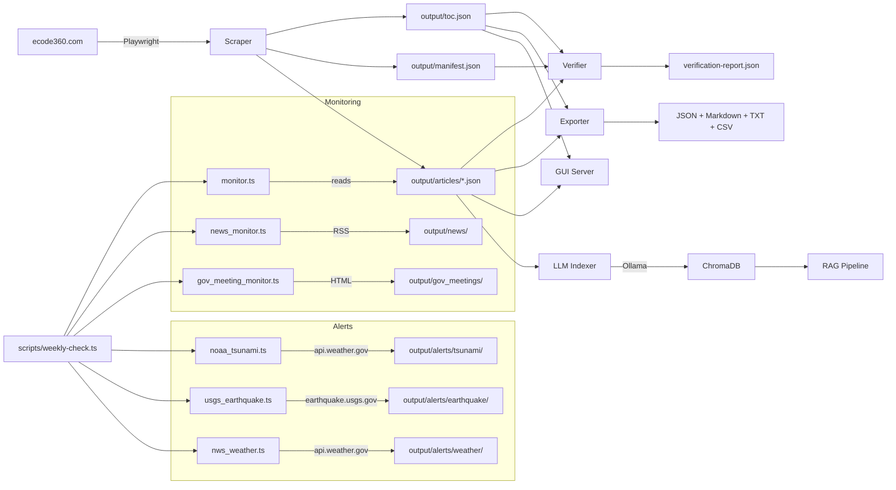
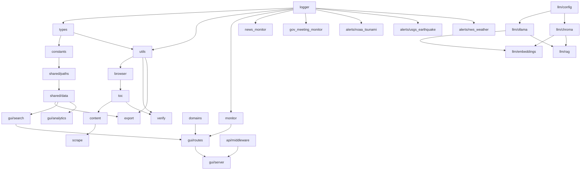

# Architecture

## System Overview

The Crescent City Intelligence Platform is a complete pipeline for scraping,
verifying, exporting, viewing, querying, monitoring, alerting, and analyzing
the Crescent City, CA municipal code from [ecode360.com](https://ecode360.com/CR4919).
It includes 8 real-time alert monitors, 12 civic intelligence domains,
structured query capabilities, legal citation parsing, fuzzy search,
streaming RAG, and a comprehensive analytics dashboard.

```text
ecode360.com/CR4919
        │
   ┌────▼────┐
   │ Scraper  │  Playwright + Cloudflare bypass
   └────┬────┘
        │
  output/articles/*.json  (242 articles, 2194 sections)
        │
   ┌────▼────┐
   │ Verifier │  SHA-256 + TOC cross-reference + live re-fetch
   └────┬────┘
        │
   ┌────▼────┐
   │ Exporter │  JSON, Markdown, plain text, CSV
   └────┬────┘
        │
   ┌────┴────────────────┐
   │                     │
┌──▼──┐           ┌───▼────┐
│ GUI │           │  LLM   │
│:3000│           │ RAG    │
│ BM25│           │+SSE    │
│+Fuzzy│          └────────┘
└─────┘

Real-Time Intelligence Layer (8 monitors):
┌──────────────────────────────────────┐
│ Alerts                                │
│  noaa_tsunami.ts    NOAA CAP          │
│  usgs_earthquake.ts USGS GeoJSON      │
│  nws_weather.ts     NWS CAZ006        │
│  noaa_tides.ts      CO-OPS 9419750    │
│  cdfw_fishing.ts    CDFW crab season  │
│  epa_airnow.ts      EPA AQI (v2.0)    │
│  calfire_wildfire.ts CAL FIRE (v2.0)  │
│  ndbc_marine.ts     NDBC buoys (v2.0) │
│  severity.ts        8-monitor composite│
└──────────────────────────────────────┘

Structured Query + Legal Analysis (v2.0):
┌──────────────────────────────────────┐
│ structured_queries.ts                │
│  Legislative history + section diff  │
│  Semantic similarity + cross-ref val│
│ legal_parser.ts                      │
│  Citation extraction + glossary     │
│ alert_analytics.ts                   │
│  Unified timeline + per-type stats  │
└──────────────────────────────────────┘

Monitoring:
┌──────────────────────────────────────┐
│  monitor.ts          Change detection│
│  news_monitor.ts     RSS (4 sources) │
│  gov_meeting_monitor.ts 3 commissions│
│  monthly_report.ts  Civic health     │
└──────────────────────────────────────┘
```

## Data Flow



## Module Dependency Graph



## Directory Structure

```text
src/
  types.ts              # All TypeScript interfaces
  constants.ts          # Centralized constants + env-overridable params
  utils.ts              # Pure utilities (hash, flatten, HTML, CSV, filename)
  logger.ts             # Structured logging (createLogger, setLogLevel)
  browser.ts            # Playwright lifecycle + Cloudflare bypass
  toc.ts                # TOC fetcher + tree utilities
  content.ts            # Page scraper + section extraction
  scrape.ts             # Scraper orchestrator with resume
  verify.ts             # Verification engine
  export.ts             # Multi-format exporter
  domains.ts            # Intelligence domain data + search
  monitor.ts            # Municipal code change detection
  news_monitor.ts       # RSS news aggregation
  gov_meeting_monitor.ts # Government meeting agenda tracker
  shared/
    paths.ts            # Centralized output path constants
    data.ts             # Data loading layer (loadToc, loadArticle, etc.)
  gui/
    server.ts           # Bun.serve() HTTP server (port 3000)
    routes.ts           # All /api/* route handlers
    search.ts           # In-memory full-text search engine
    analytics.ts        # PCA + K-Means + stats computation
    static/index.html   # Single-page application (no build step)
  llm/
    config.ts           # LLM configuration with env var overrides
    ollama.ts           # Ollama API wrapper
    chroma.ts           # ChromaDB client
    embeddings.ts       # Chunk + embed + index pipeline
    rag.ts              # RAG pipeline (embed → retrieve → generate)
    index.ts            # CLI entry point
  api/
    middleware.ts       # Rate limiting + API key auth + request logging
  alerts/
    noaa_tsunami.ts     # NOAA CAP tsunami alert monitor
    usgs_earthquake.ts  # USGS GeoJSON earthquake monitor
    nws_weather.ts      # NWS weather alert monitor (CAZ006)
scripts/
  weekly-check.ts       # Weekly health check orchestrator
  run-monitor.ts        # Change detection script
  run-alerts.ts         # All alert monitors (concurrent)
  run-news.ts           # RSS news monitor script
  run-meetings.ts       # Government meeting monitor script
  weekly-check.sh       # Legacy bash wrapper (kept for reference)
tests/
  utils.test.ts         # 22 tests
  constants.test.ts     # 5 tests
  constants-extended.test.ts # 10 tests
  logger.test.ts        # 6 tests
  toc.test.ts           # 10 tests
  shared-paths.test.ts  # 10 tests
  shared-data.test.ts   # 6 tests
  search.test.ts        # 8 tests
  analytics.test.ts     # 7 tests
  llm-config.test.ts    # 8 tests
  routes.test.ts        # 7 tests
  embeddings.test.ts    # 7 tests
  export.test.ts        # 12 tests
  domains.test.ts       # 14 tests
  monitor.test.ts       # 3 tests
  news_monitor.test.ts  # 3 tests
  gov_meeting_monitor.test.ts # 2 tests
docs/                   # This documentation
output/                 # Scraped data (gitignored)
```

## Runtime Dependencies

| Dependency | Purpose | Required |
| :--- | :--- | :--- |
| [Bun](https://bun.sh) | Runtime + test runner | Always |
| [Playwright](https://playwright.dev) | Browser automation for scraping | Scraper only |
| [@xmldom/xmldom](https://github.com/xmldom/xmldom) | XML/RSS parsing | News + NOAA monitors |
| [Ollama](https://ollama.ai) | Embeddings + chat models | LLM features |
| [ChromaDB](https://trychroma.com) | Vector storage | LLM features |

## Deployment Modes

| Mode | Start command | Requires |
| :--- | :--- | :--- |
| GUI only | `bun run gui` | Scraped `output/` data |
| Full RAG | `bun run gui` + `bun run index` | Ollama + ChromaDB + scraped data |
| Monitoring | `bun run weekly-check` | Cron + scraped data |
| Alerts | `bun run alerts` | Internet access |
