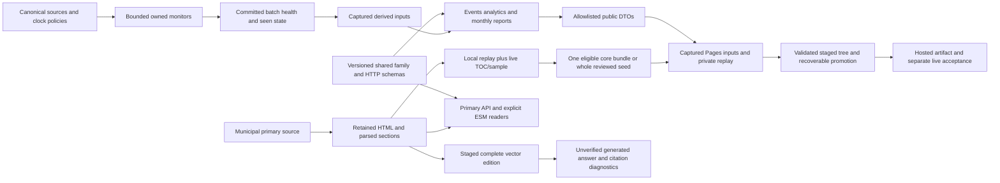

# Architecture

## System Overview

The Crescent City Intelligence Platform provides a pipeline for scraping,
verifying, exporting, viewing, querying, monitoring, alerting, and analyzing
the Crescent City, CA municipal code from [ecode360.com](https://ecode360.com/CR4919).
It includes 20 real-time alert monitors (8 core + 12 extended), 12 civic intelligence domains,
structured query capabilities, legal citation parsing, fuzzy search,
streaming RAG, and a comprehensive analytics dashboard.

```text
ecode360.com/CR4919
        │
   ┌────▼────┐
   │ Scraper  │  Playwright + Cloudflare bypass
   └────┬────┘
        │
  output/articles/*.json  (counts from output/manifest.json)
        │
   ┌────▼────┐
   │ Verifier │  SHA-256 + TOC cross-reference + live re-fetch
   └────┬────┘
        │
   ┌────▼────┐
   │ Exporter │  JSON, Markdown, plain text, CSV
   └────┬────┘
        │
   ┌────┴────────────────┐
   │                     │
┌──▼──┐           ┌───▼────┐
│ GUI │           │  LLM   │
│:3000│           │ RAG    │
│ BM25│           │+SSE    │
│+Fuzzy│          └────────┘
└─────┘
```

The static public surface is built separately by `pages_snapshot.ts` from a
bounded allowlist of generated artifacts. It is deployed by GitHub Actions and
does not connect to the local GUI API, Ollama, or ChromaDB.

```text
Real-Time Intelligence Layer (20 monitors: 8 core + 12 extended):
┌──────────────────────────────────────┐
│ Alerts                                │
│  noaa_tsunami.ts    NOAA CAP          │
│  usgs_earthquake.ts USGS GeoJSON      │
│  nws_weather.ts     NWS CAZ101        │
│  noaa_tides.ts      CO-OPS 9419750    │
│  cdfw_fishing.ts    CDFW crab season  │
│  epa_airnow.ts      EPA AQI           │
│  calfire_wildfire.ts CAL FIRE         │
│  ndbc_marine.ts     NDBC buoys        │
│  nws_marine.ts     NWS CWF (PZZ450)   │
│  usdm_drought.ts   USDM area %       │
│  pge_psps.ts       PSPS shutoffs     │
│  hrrr_smoke.ts     HMS/HRRR smoke    │
│  caltrans_roads.ts Caltrans roads    │
│  dusd_schools.ts   DUSD closures     │
│  uscg_broadcasts.ts USCG BNM (D11)   │
│  permits.ts        MyGov permits     │
│  dredging.ts       Harbor sitemap    │
│  fuel.ts           EIA CA retail gas │
│  pacfin.ts         PacFIN catalog    │
│  ais.ts            AIS vessel feeds  │
│  severity.ts       20-monitor composite│
└──────────────────────────────────────┘
```

Each monitor is published under a `source` name in
`output/alerts/source-health.json`, and that name — not the module filename — is
what the GUI tiles, the heatmap rows, the coverage percentages and the pages
dashboard display. The two vocabularies are easy to confuse, so the mapping is
stated here rather than left to be inferred:

| Module | `MONITOR_KEYS` key | Source-health name | Output |
| :--- | :--- | :--- | :--- |
| `noaa_tsunami.ts` | `tsunami` | NOAA Tsunami | `output/alerts/tsunami/` |
| `usgs_earthquake.ts` | `earthquake` | USGS Earthquake | `output/alerts/earthquake/` |
| `nws_weather.ts` | `weather` | NWS Weather | `output/alerts/weather/` |
| `epa_airnow.ts` | `airquality` | EPA AirNow | `output/alerts/airquality/` |
| `calfire_wildfire.ts` | `wildfire` | CAL FIRE Wildfire | `output/alerts/wildfire/` |
| `ndbc_marine.ts` | `marine` | NDBC Marine | `output/alerts/marine/` |
| `nws_marine.ts` | `marinezone` | NWS Marine Forecast | `output/alerts/marinezone/` |
| `noaa_tides.ts` | `tides` | NOAA Tides | `output/tides/` |
| `cdfw_fishing.ts` | `fishing` | CDFW Fishing | `output/fishing/` |
| `usdm_drought.ts` | `drought` | USDM Drought | `output/alerts/drought/` |
| `pge_psps.ts` | `psps` | PG&E PSPS | `output/alerts/psps/` |
| `hrrr_smoke.ts` | `smoke` | HRRR Smoke | `output/alerts/smoke/` |
| `caltrans_roads.ts` | `roads` | Caltrans Roads | `output/alerts/roads/` |
| `dusd_schools.ts` | `schools` | DUSD Schools | `output/alerts/schools/` |
| `uscg_broadcasts.ts` | `uscg` | USCG Broadcast Notice to Mariners | `output/alerts/uscg/` |
| `permits.ts` | `permits` | Crescent City Permits Portal | `output/alerts/permits/` |
| `dredging.ts` | `dredging` | Crescent City Harbor District | `output/alerts/dredging/` |
| `fuel.ts` | `fuel` | EIA California Fuel | `output/alerts/fuel/` |
| `pacfin.ts` | `pacfin` | PacFIN Reports Dashboard | `output/alerts/pacfin/` |
| `ais.ts` | `ais` | AIS Vessel Traffic | `output/alerts/ais/` |

Two monitors write outside `output/alerts/`: tides and fishing, which keep their
own stable top-level artifact directories. A
third vocabulary exists in the composite's `monitors` record, which spells air
quality `airQuality` (camelCase) where everything else says `airquality`;
`SEVERITY_MONITOR_KEYS` in `src/alerts/severity.ts` names it and
`tests/alert-source-roster.test.ts` asserts all three agree.

`MONITOR_KEYS` in `src/alerts/composite.ts` is the canonical roster. Every other
list derives from it or is asserted against it — see `src/alerts/AGENTS.md`.

```text
Structured Query + Legal Analysis:
┌──────────────────────────────────────┐
│ structured_queries.ts                │
│  Legislative history + section diff  │
│  Semantic similarity + cross-ref val│
│ legal_parser.ts                      │
│  Citation extraction + glossary     │
│ alert_analytics.ts                   │
│  Unified timeline + per-type stats  │
└──────────────────────────────────────┘

Monitoring:
┌──────────────────────────────────────┐
│  monitor.ts          Change detection│
│  news_monitor.ts     RSS/Atom (configured + health)│
│  gov_meeting_monitor.ts Official archives│
│  monthly_report.ts  Civic health     │
└──────────────────────────────────────┘
```

## Data flow and authorities


```mermaid
flowchart LR
    Primary[Municipal primary source] --> Corpus[Retained HTML and parsed sections]
    Corpus --> Verify[Local replay plus live TOC/sample]
    Verify --> Core[One eligible core bundle or whole reviewed seed]
    Registry[Canonical sources and clock policies] --> Producers[Bounded owned monitors]
    Producers --> Batch[Committed batch health and seen state]
    Batch --> Capture[Captured derived inputs]
    Capture --> Derived[Events analytics and monthly reports]
    Schemas[Versioned shared family and HTTP schemas] --> Derived
    Derived --> DTO[Allowlisted public DTOs]
    Core --> Pages[Captured Pages inputs and private replay]
    DTO --> Pages
    Pages --> Stage[Validated staged tree and recoverable promotion]
    Stage --> Hosting[Hosted artifact and separate live acceptance]
    Corpus --> GUI[Primary API and explicit ESM readers]
    Schemas --> GUI
    Corpus --> Index[Staged complete vector edition]
    Index --> RAG[Unverified generated answer and citation diagnostics]
```

`schema_validation.ts` and `artifact_contracts.ts` are reused at producer/loader,
annotated API response and Pages boundaries. Structural `openapi.yaml` governs
HTTP methods/auth/inputs/responses; `doc_inventory.ts` generates configuration,
qualified export and HTTP inventories without evaluating actual environment
values. Dynamic configuration reads remain disclosed.

`shared/paths.ts` and `shared/run_scope.ts` retain root/cancellation ownership.
`shared/storage.ts`, `shared/artifact_transaction.ts` and owned process/browser
receipts protect same-root writes, interrupted publication and descendant
shutdown. `source_clocks.ts` keeps acquisition time separate from required
observation/product evidence. `artifact_custody.ts`, `derived_publication.ts`
and `pages_publication_inputs.ts` bind exact inputs/transformers/configuration/
outputs and support private local replay. These bindings do not establish legal
or semantic truth.

The GUI imports explicit modules and one mutable state owner. Reader lifecycle,
inert rendering and local assets share the API's finite/cancellation/privacy
boundaries. The private directory/semantic review ledgers and source-bound
`corpus_lineage.ts` candidates retain unknown facts and named review status;
public projection never invents completed human review.

## Directory Structure

This is an orientation map; [AGENTS.md](../AGENTS.md#directory-map) contains the
full checked source inventory and [generated exports](generated/exports.md) names
qualified declarations.

```text
src/
  types.ts              # All TypeScript interfaces
  constants.ts          # Centralized constants + env-overridable params
  utils.ts              # Pure utilities (hash, flatten, HTML, CSV, filename)
  logger.ts             # Structured logging (createLogger, setLogLevel)
  browser.ts            # Playwright lifecycle + Cloudflare bypass
  toc.ts                # TOC fetcher + tree utilities
  content.ts            # Page scraper + section extraction
  scrape.ts             # Scraper orchestrator with resume
  scraper_utils.ts      # TOC/artifact validation and retry utilities
  verify.ts             # Verification engine
  export.ts             # Multi-format exporter
  domains.ts            # Intelligence domain data + search
  monitor.ts            # Municipal code change detection
  news_monitor.ts       # RSS news aggregation
  gov_meeting_monitor.ts # Government meeting agenda tracker
  youtube_monitor.ts     # YouTube meeting transcripts + source health
  triplicate_monitor.ts  # Reference-only Triplicate metadata + citations
  curation.ts             # Provider-aware news/meeting/YouTube curation
  monthly_report.ts      # Period-specific civic health report
  pages_snapshot.ts      # Bounded public GitHub Pages snapshot exporter
  shared/
    paths.ts            # Centralized output path constants
    data.ts             # Data loading layer (loadToc, loadArticle, etc.)
  gui/
    server.ts           # Bun.serve() HTTP server (port 3000)
    routes.ts           # All /api/* route handlers
    search.ts           # In-memory full-text search engine
    analytics.ts        # PCA + K-Means + stats computation
    static/index.html   # Single-page application (no build step)
  llm/
    config.ts           # LLM configuration with env var overrides
    ollama.ts           # Ollama API wrapper
    chroma.ts           # ChromaDB client
    embeddings.ts       # Chunk + embed + index pipeline
    rag.ts              # RAG pipeline (embed → retrieve → generate)
    index.ts            # CLI entry point
  pages/
    static/index.html   # Static Pages dashboard
    static/404.html     # Static Pages fallback
  api/
    middleware.ts       # Rate limiting + API key auth + request logging
  alerts/
    noaa_tsunami.ts     # NOAA CAP tsunami alert monitor
    usgs_earthquake.ts  # USGS GeoJSON earthquake monitor
    nws_weather.ts      # NWS weather alert monitor (CAZ101)
scripts/
  weekly-check.ts       # Weekly health check orchestrator
  run-monitor.ts        # Change detection script
  run-alerts.ts         # All alert monitors (concurrent)
  run-news.ts           # RSS news monitor script
  run-meetings.ts       # Government meeting monitor script
  run-youtube.ts        # YouTube meeting transcript pipeline script
  run-curation.ts       # LLM curation pipeline script
  export-pages.ts       # Static Pages exporter
  validate-pages.ts     # Static Pages artifact validator
tests/                  # Deterministic suite discovered by Bun (run bun run validate)
  *.test.ts             # Module, route, provider, feed, alert, and integration tests
docs/                   # This documentation
output/                 # Scraped data (gitignored)
```

## Runtime Dependencies

| Dependency | Purpose | Required |
| :--- | :--- | :--- |
| [Bun](https://bun.sh) | Runtime + test runner | Always |
| [Playwright](https://playwright.dev) | Owned browser acquisition and native reader/Pages checks | Scraper and browser acceptance |
| [@xmldom/xmldom](https://github.com/xmldom/xmldom) | XML/RSS parsing | News + NOAA monitors |
| [Ollama](https://ollama.ai) | Embeddings + chat models | LLM features |
| [ChromaDB](https://trychroma.com) | Vector storage | LLM features |

## Deployment Modes

| Mode | Start command | Requires |
| :--- | :--- | :--- |
| GUI only | `bun run gui` | Selected artifact root; genuinely absent/empty data yields empty search and unavailable code stats |
| Full RAG | `bun run gui` + `bun run index` | Ollama + ChromaDB + scraped data |
| Monitoring | `bun run weekly-check` | Declared source access and selected artifact root; scheduler activation is separate |
| Alerts | `bun run alerts` | Internet access |
