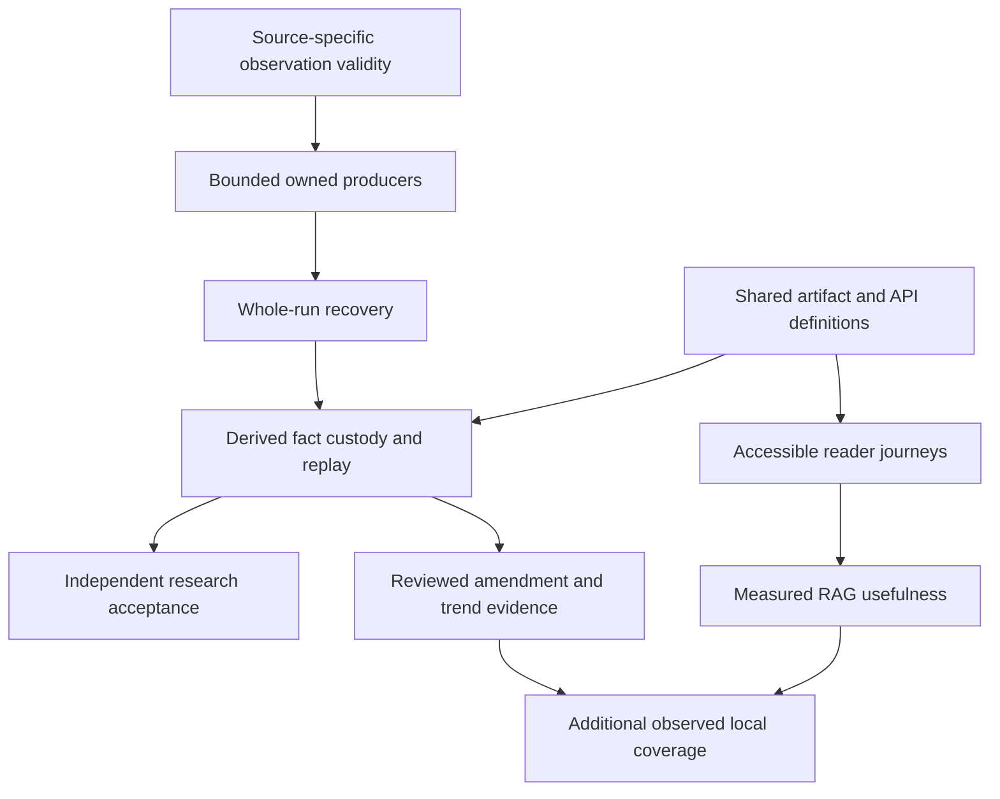

# Roadmap — The Quadruplicate

Delivery proceeds from measured reliability to useful coverage. The existing
platform has strict source/corpus custody, runtime API contracts, staged
indexes and publication, and native browser/backend/research acceptance.
The [current-state review](project-review.md) states the limits of that
acceptance. [TODO.md](../TODO.md) is the only item-level backlog;
[CHANGELOG.md](../CHANGELOG.md) is the only version history.

## Remaining delivery sequence

| Stage | Goal | Open scopes | Exit evidence |
| :--- | :--- | :--- | :--- |
| 1 | Complete ownership, cancellation and source validity | M04, M06–M08, M21, M24, M31–M33 | Every producer and direct SDK boundary has bounded real failure cases; whole-run cancellation and interrupted recovery preserve exact prior evidence |
| 2 | Reduce contract duplication and finish reproducible operations | S07, M29–M30, M34; L01–L02 | Generated documentation and family validators share authorities; persistent empty-volume/restart and scheduler fixtures preserve ownership; derived public facts have replayable custody |
| 3 | Measure usefulness and temporal meaning | M25–M27; L03–L04, L06, L08 | Semantic support and usefulness are evaluated separately; recurrence, revisions, cadence and legal dates retain primary evidence; every reader journey and independent research replay has its own receipt |
| 4 | Expand observed local coverage | L05, L07 | Source-specific access/budget/ownership, captured representative fixtures, bounded live collection and demonstrated geographic/temporal coverage |

Parallel work has one owner per file and contract. Security and shared
infrastructure receive fresh independent review. A source outage remains a
coverage fact; a runner, parser or custody failure remains an execution or
integrity failure. Resolve those boundaries before strengthening claims.

## Planning boundaries

- Retain offline deterministic fixtures and actual local HTTP/process/browser
  failure cases. Separate local tests, native services, hosted workflows,
  upstream collection, external consumers and deployed-site acceptance.
- Permit catalogs, PacFIN catalogs, statewide fuel prices and unestablished
  local AIS coverage must retain their actual meaning. Access, credentials,
  subscriptions and spending remain explicit owner decisions.
- Native PDF page extraction preserves bytes and spans; it does not establish
  votes, ordinance effectivity or semantic extraction correctness. Citation
  identity does not establish answer support or independent corroboration.
- Preserve private query/operator state and prior complete editions. Scheduler
  installation, external private-state edits and notification display have
  their own ownership and acceptance boundaries.
- Close an item only after its remaining acceptance has evidence, remove it
  from TODO, and record the change once in CHANGELOG.
