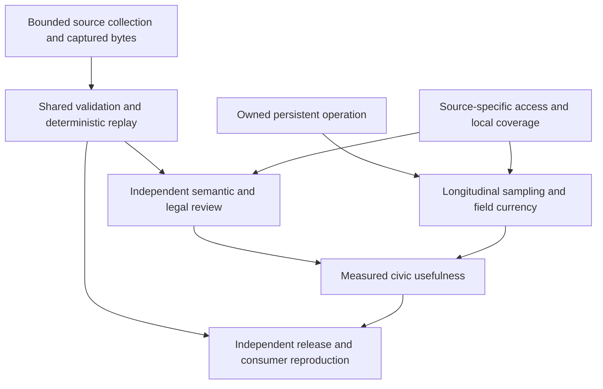

# Roadmap — The Quadruplicate

Delivery proceeds from measured reliability to useful coverage. The operating
platform uses bounded owned producers, current-cycle source validity, shared
versioned artifact/API definitions, explicit GUI modules and retained input/
transformation/output custody. The [current-state review](project-review.md)
states these contracts and their evidence limits. [TODO.md](../TODO.md) is the
only item-level backlog; [CHANGELOG.md](../CHANGELOG.md) is the only version
history.

## Acceptance sequence

| Stage | Goal | Open scopes | Exit evidence |
| --- | --- | --- | --- |
| 1 | Establish real destination and host operation | M07, M27, M29 | Opted-in notification delivery, actual committed-digest consumer, persistent host restart/scheduler and backup/restore receipts |
| 2 | Independently interpret source-backed products | L03, L06, L07 | Named human review of answer support, adopted ordinance spans, directory field currency and representative calendar/sampling evidence |
| 3 | Acquire useful additional local evidence | L05 | Source-specific access/terms/budget ownership plus captured primary local records with declared geographic and temporal units |
| 4 | Reproduce the precise release externally | L08 | Independent clean-environment deterministic replay, named actual consumer integration, research metrics and separate hosted/live publication receipts |

These stages can overlap when their prerequisites exist. Source access does not
have to wait for production deployment, and local software tests do not have to
wait for human interpretation. Stronger public claims wait for the corresponding
source, review or operating receipt. Re-estimate implementation from a concrete
new counterexample; do not keep a repaired defect listed as future work.

## Evidence boundaries

- Keep deterministic fixtures, real local HTTP/process/browser failures, actual
  upstream collection, native services, external consumers, hosted workflows and
  deployed-site acceptance as separately named evidence.
- Catalog access, statewide fuel, qualitative smoke and foreign AIS observations
  retain their actual units. Missing primary clocks, parser failures and local
  coverage gaps cannot become fresh observations through a reachability probe.
- PDF extraction preserves bytes and spans. It does not establish votes,
  ordinance authority or legal effectivity. Citation identity and imported
  annotations do not establish semantic support or independent corroboration.
- Preserve prior complete editions and private query/operator/source archives.
  Host activation, personal consumer-state edits, notification opt-in and paid
  access require precise owner decisions and their own acceptance.
- Remove an open item only when its stated acceptance has evidence. Record
  version history once in CHANGELOG and retain the receipt's actual date,
  source revision and scope.
